# Online Retail Data Set
This is a transnational data set which contains all the transactions occurring between 01/12/2010 and 09/12/2011 for a UK-based and registered non-store online retail.The company mainly sells unique all-occasion gifts. Many customers of the company are wholesalers.

Source: https://archive.ics.uci.edu/ml/datasets/online+retail

The aim of this analysis is to use data science techniques to answer the following business questions and in so doing showcase my analytical and programming skills to solve business problems.

### PART A
#### 1. Business Metrics
        - Monthly Revenue
        - Monthly Growth Rate
        - Revenue by Country
        - Monthly Active Customers
        - Monthly Orders
        - Average Revenue per Order
    
    
#### 2. Customer Metrics
        - Dividing customers into types : New & Existing Customers
        - Monthly Retention rate
        - Churn rate
        - Cohort-based retention rate


### PART B
#### 3.1 Market Attribution Modelling

        - Markov Chain model
        - First Touch attribution model
        - Last Touch attribution model

#### 3. 2. Comparison of number of conversions attributed to market attribution models
    
    
    
  
  
    
### PART C
#### 4.1 Customer Segmentation
        - RFM Segmentation: Divide customers into segments

#### 4.2 Recommendation


#### Import Packages


```python
from datetime import datetime, timedelta
import pandas as pd
import matplotlib.pyplot as plt
import numpy as np
import seaborn as sns
from datetime import datetime as dt
from collections import defaultdict
import warnings
import random
from sklearn.cluster import KMeans
random.seed(123)
warnings.filterwarnings('ignore')
%matplotlib inline
```

# PART A

## 1. BUSINESS METRICS

This section aims at using the combination of programming and data analysis to answer business questions on revenue, growth rate, average revenue per order, etc.


```python
tx_data = pd.read_csv('OnlineRetail.csv',encoding = "ISO-8859-1")
tx_data.head()
```


<div>
<style scoped>
    .dataframe tbody tr th:only-of-type {
        vertical-align: middle;
    }

    .dataframe tbody tr th {
        vertical-align: top;
    }

    .dataframe thead th {
        text-align: right;
    }
</style>
<table border="1" class="dataframe">
  <thead>
    <tr style="text-align: right;">
      <th></th>
      <th>InvoiceNo</th>
      <th>StockCode</th>
      <th>Description</th>
      <th>Quantity</th>
      <th>InvoiceDate</th>
      <th>UnitPrice</th>
      <th>CustomerID</th>
      <th>Country</th>
    </tr>
  </thead>
  <tbody>
    <tr>
      <th>0</th>
      <td>536365</td>
      <td>85123A</td>
      <td>WHITE HANGING HEART T-LIGHT HOLDER</td>
      <td>6</td>
      <td>12/1/2010 8:26</td>
      <td>2.55</td>
      <td>17850.0</td>
      <td>United Kingdom</td>
    </tr>
    <tr>
      <th>1</th>
      <td>536365</td>
      <td>71053</td>
      <td>WHITE METAL LANTERN</td>
      <td>6</td>
      <td>12/1/2010 8:26</td>
      <td>3.39</td>
      <td>17850.0</td>
      <td>United Kingdom</td>
    </tr>
    <tr>
      <th>2</th>
      <td>536365</td>
      <td>84406B</td>
      <td>CREAM CUPID HEARTS COAT HANGER</td>
      <td>8</td>
      <td>12/1/2010 8:26</td>
      <td>2.75</td>
      <td>17850.0</td>
      <td>United Kingdom</td>
    </tr>
    <tr>
      <th>3</th>
      <td>536365</td>
      <td>84029G</td>
      <td>KNITTED UNION FLAG HOT WATER BOTTLE</td>
      <td>6</td>
      <td>12/1/2010 8:26</td>
      <td>3.39</td>
      <td>17850.0</td>
      <td>United Kingdom</td>
    </tr>
    <tr>
      <th>4</th>
      <td>536365</td>
      <td>84029E</td>
      <td>RED WOOLLY HOTTIE WHITE HEART.</td>
      <td>6</td>
      <td>12/1/2010 8:26</td>
      <td>3.39</td>
      <td>17850.0</td>
      <td>United Kingdom</td>
    </tr>
  </tbody>
</table>
</div>


```python
tx_data['InvoiceDate'] = pd.to_datetime(tx_data['InvoiceDate'])
```


```python
#tx_data['InvoiceYearMonth'] = [str(x) + str(y) + z for x, y, z in zip(tx_data['InvoiceDate'].dt.year, tx_data['InvoiceDate'].dt.month, tx_data['InvoiceDate'].dt.strftime('%b'))]
tx_data['InvoiceYearMonth'] = tx_data['InvoiceDate'].map(lambda date: 100*date.year + date.month)
tx_data.head()
```


<div>
<style scoped>
    .dataframe tbody tr th:only-of-type {
        vertical-align: middle;
    }

    .dataframe tbody tr th {
        vertical-align: top;
    }

    .dataframe thead th {
        text-align: right;
    }
</style>
<table border="1" class="dataframe">
  <thead>
    <tr style="text-align: right;">
      <th></th>
      <th>InvoiceNo</th>
      <th>StockCode</th>
      <th>Description</th>
      <th>Quantity</th>
      <th>InvoiceDate</th>
      <th>UnitPrice</th>
      <th>CustomerID</th>
      <th>Country</th>
      <th>InvoiceYearMonth</th>
    </tr>
  </thead>
  <tbody>
    <tr>
      <th>0</th>
      <td>536365</td>
      <td>85123A</td>
      <td>WHITE HANGING HEART T-LIGHT HOLDER</td>
      <td>6</td>
      <td>2010-12-01 08:26:00</td>
      <td>2.55</td>
      <td>17850.0</td>
      <td>United Kingdom</td>
      <td>201012</td>
    </tr>
    <tr>
      <th>1</th>
      <td>536365</td>
      <td>71053</td>
      <td>WHITE METAL LANTERN</td>
      <td>6</td>
      <td>2010-12-01 08:26:00</td>
      <td>3.39</td>
      <td>17850.0</td>
      <td>United Kingdom</td>
      <td>201012</td>
    </tr>
    <tr>
      <th>2</th>
      <td>536365</td>
      <td>84406B</td>
      <td>CREAM CUPID HEARTS COAT HANGER</td>
      <td>8</td>
      <td>2010-12-01 08:26:00</td>
      <td>2.75</td>
      <td>17850.0</td>
      <td>United Kingdom</td>
      <td>201012</td>
    </tr>
    <tr>
      <th>3</th>
      <td>536365</td>
      <td>84029G</td>
      <td>KNITTED UNION FLAG HOT WATER BOTTLE</td>
      <td>6</td>
      <td>2010-12-01 08:26:00</td>
      <td>3.39</td>
      <td>17850.0</td>
      <td>United Kingdom</td>
      <td>201012</td>
    </tr>
    <tr>
      <th>4</th>
      <td>536365</td>
      <td>84029E</td>
      <td>RED WOOLLY HOTTIE WHITE HEART.</td>
      <td>6</td>
      <td>2010-12-01 08:26:00</td>
      <td>3.39</td>
      <td>17850.0</td>
      <td>United Kingdom</td>
      <td>201012</td>
    </tr>
  </tbody>
</table>
</div>


```python
tx_data['Revenue'] = tx_data['UnitPrice'] * tx_data['Quantity']
```

## 1.1 Monthly Revenue


```python
tx_data.groupby('InvoiceYearMonth')['Revenue'].sum()
```


    InvoiceYearMonth
    201012     748957.020
    201101     560000.260
    201102     498062.650
    201103     683267.080
    201104     493207.121
    201105     723333.510
    201106     691123.120
    201107     681300.111
    201108     682680.510
    201109    1019687.622
    201110    1070704.670
    201111    1461756.250
    201112     433668.010
    Name: Revenue, dtype: float64


```python
tx_revenue = tx_data.groupby(['InvoiceYearMonth'])['Revenue'].sum().reset_index()
```


```python
tx_revenue
```


<div>
<style scoped>
    .dataframe tbody tr th:only-of-type {
        vertical-align: middle;
    }

    .dataframe tbody tr th {
        vertical-align: top;
    }

    .dataframe thead th {
        text-align: right;
    }
</style>
<table border="1" class="dataframe">
  <thead>
    <tr style="text-align: right;">
      <th></th>
      <th>InvoiceYearMonth</th>
      <th>Revenue</th>
    </tr>
  </thead>
  <tbody>
    <tr>
      <th>0</th>
      <td>201012</td>
      <td>748957.020</td>
    </tr>
    <tr>
      <th>1</th>
      <td>201101</td>
      <td>560000.260</td>
    </tr>
    <tr>
      <th>2</th>
      <td>201102</td>
      <td>498062.650</td>
    </tr>
    <tr>
      <th>3</th>
      <td>201103</td>
      <td>683267.080</td>
    </tr>
    <tr>
      <th>4</th>
      <td>201104</td>
      <td>493207.121</td>
    </tr>
    <tr>
      <th>5</th>
      <td>201105</td>
      <td>723333.510</td>
    </tr>
    <tr>
      <th>6</th>
      <td>201106</td>
      <td>691123.120</td>
    </tr>
    <tr>
      <th>7</th>
      <td>201107</td>
      <td>681300.111</td>
    </tr>
    <tr>
      <th>8</th>
      <td>201108</td>
      <td>682680.510</td>
    </tr>
    <tr>
      <th>9</th>
      <td>201109</td>
      <td>1019687.622</td>
    </tr>
    <tr>
      <th>10</th>
      <td>201110</td>
      <td>1070704.670</td>
    </tr>
    <tr>
      <th>11</th>
      <td>201111</td>
      <td>1461756.250</td>
    </tr>
    <tr>
      <th>12</th>
      <td>201112</td>
      <td>433668.010</td>
    </tr>
  </tbody>
</table>
</div>


```python
tx_data['InvoiceYearMonth'] = tx_data['InvoiceYearMonth'].astype(str)
tx_revenue["InvoiceYearMonth"] = tx_revenue["InvoiceYearMonth"].astype(str)
#tx_revenue.plot(x='InvoiceYearMonth', y='Revenue', kind='line', ylim=[0,1500000], legend=False, figsize=(16,5))
plt.figure(figsize=(16,5),dpi=300)
#tx_revenue.plot.line(x='InvoiceYearMonth', y='Revenue',ylim=[0,1500000], legend=False,figsize=(16,5))
sns.lineplot(data=tx_revenue, x="InvoiceYearMonth", y="Revenue")
plt.title('Monthly Revenue')
```


    Text(0.5, 1.0, 'Monthly Revenue')


    
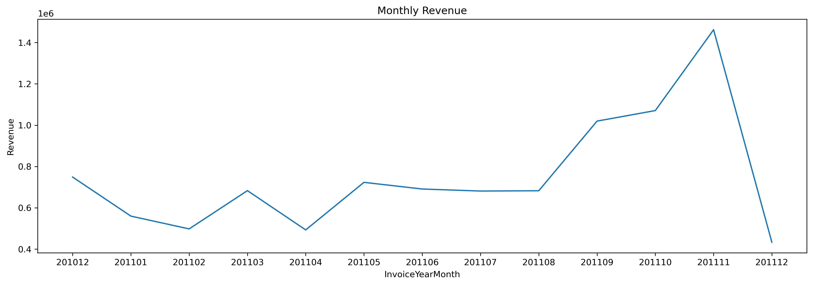
    


## 1.2 Monthly Growth Rate


```python
tx_revenue['MonthlyGrowth'] = round(tx_revenue['Revenue'].pct_change(),2)
tx_revenue.head()
```


<div>
<style scoped>
    .dataframe tbody tr th:only-of-type {
        vertical-align: middle;
    }

    .dataframe tbody tr th {
        vertical-align: top;
    }

    .dataframe thead th {
        text-align: right;
    }
</style>
<table border="1" class="dataframe">
  <thead>
    <tr style="text-align: right;">
      <th></th>
      <th>InvoiceYearMonth</th>
      <th>Revenue</th>
      <th>MonthlyGrowth</th>
    </tr>
  </thead>
  <tbody>
    <tr>
      <th>0</th>
      <td>201012</td>
      <td>748957.020</td>
      <td>NaN</td>
    </tr>
    <tr>
      <th>1</th>
      <td>201101</td>
      <td>560000.260</td>
      <td>-0.25</td>
    </tr>
    <tr>
      <th>2</th>
      <td>201102</td>
      <td>498062.650</td>
      <td>-0.11</td>
    </tr>
    <tr>
      <th>3</th>
      <td>201103</td>
      <td>683267.080</td>
      <td>0.37</td>
    </tr>
    <tr>
      <th>4</th>
      <td>201104</td>
      <td>493207.121</td>
      <td>-0.28</td>
    </tr>
  </tbody>
</table>
</div>


```python
#tx_revenue.plot(x='InvoiceYearMonth', y='MonthlyGrowth', kind='line', legend=False, figsize=(16,5))
plt.figure(figsize=(16,5),dpi=300)
#tx_revenue.plot.line(x='InvoiceYearMonth', y='Revenue',ylim=[0,1500000], legend=False,figsize=(16,5))
sns.lineplot(data=tx_revenue, x="InvoiceYearMonth", y="MonthlyGrowth")
#tx_revenue.plot.line(x='InvoiceYearMonth', y='MonthlyGrowth',legend=False, figsize=(16,5))
plt.ylabel('Growth Rate')
plt.title('Monthly Growth Rate')
```


    Text(0.5, 1.0, 'Monthly Growth Rate')


    
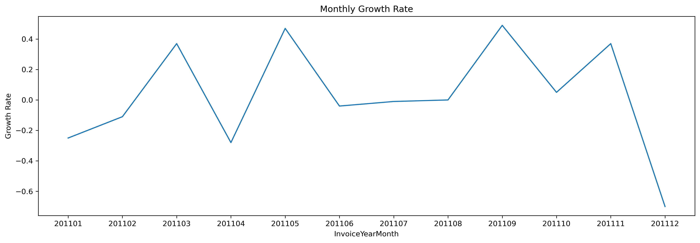
    


We experienced lowest drop in revenue (28%) in April, 2011 and we need to identify what exactly happened. 

We ask questions such as: was it due to less active customers or our customers did less orders? Maybe they just started to buy cheaper products?

## 1.3 Revenue by Country


```python
tx_data.groupby('Country')['Revenue'].sum().sort_values(ascending=False).astype(int)
```


    Country
    United Kingdom          8187806
    Netherlands              284661
    EIRE                     263276
    Germany                  221698
    France                   197403
    Australia                137077
    Switzerland               56385
    Spain                     54774
    Belgium                   40910
    Sweden                    36595
    Japan                     35340
    Norway                    35163
    Portugal                  29367
    Finland                   22326
    Channel Islands           20086
    Denmark                   18768
    Italy                     16890
    Cyprus                    12946
    Austria                   10154
    Hong Kong                 10117
    Singapore                  9120
    Israel                     7907
    Poland                     7213
    Unspecified                4749
    Greece                     4710
    Iceland                    4309
    Canada                     3666
    Malta                      2505
    United Arab Emirates       1902
    USA                        1730
    Lebanon                    1693
    Lithuania                  1661
    European Community         1291
    Brazil                     1143
    RSA                        1002
    Czech Republic              707
    Bahrain                     548
    Saudi Arabia                131
    Name: Revenue, dtype: int64


Since majority of the revenue is from United Kingdom, i will focus on this country henceforth to make the analysis easy to follow.


```python
tx_uk = tx_data[tx_data['Country'] == 'United Kingdom']
tx_uk.head()
```


<div>
<style scoped>
    .dataframe tbody tr th:only-of-type {
        vertical-align: middle;
    }

    .dataframe tbody tr th {
        vertical-align: top;
    }

    .dataframe thead th {
        text-align: right;
    }
</style>
<table border="1" class="dataframe">
  <thead>
    <tr style="text-align: right;">
      <th></th>
      <th>InvoiceNo</th>
      <th>StockCode</th>
      <th>Description</th>
      <th>Quantity</th>
      <th>InvoiceDate</th>
      <th>UnitPrice</th>
      <th>CustomerID</th>
      <th>Country</th>
      <th>InvoiceYearMonth</th>
      <th>Revenue</th>
    </tr>
  </thead>
  <tbody>
    <tr>
      <th>0</th>
      <td>536365</td>
      <td>85123A</td>
      <td>WHITE HANGING HEART T-LIGHT HOLDER</td>
      <td>6</td>
      <td>2010-12-01 08:26:00</td>
      <td>2.55</td>
      <td>17850.0</td>
      <td>United Kingdom</td>
      <td>201012</td>
      <td>15.30</td>
    </tr>
    <tr>
      <th>1</th>
      <td>536365</td>
      <td>71053</td>
      <td>WHITE METAL LANTERN</td>
      <td>6</td>
      <td>2010-12-01 08:26:00</td>
      <td>3.39</td>
      <td>17850.0</td>
      <td>United Kingdom</td>
      <td>201012</td>
      <td>20.34</td>
    </tr>
    <tr>
      <th>2</th>
      <td>536365</td>
      <td>84406B</td>
      <td>CREAM CUPID HEARTS COAT HANGER</td>
      <td>8</td>
      <td>2010-12-01 08:26:00</td>
      <td>2.75</td>
      <td>17850.0</td>
      <td>United Kingdom</td>
      <td>201012</td>
      <td>22.00</td>
    </tr>
    <tr>
      <th>3</th>
      <td>536365</td>
      <td>84029G</td>
      <td>KNITTED UNION FLAG HOT WATER BOTTLE</td>
      <td>6</td>
      <td>2010-12-01 08:26:00</td>
      <td>3.39</td>
      <td>17850.0</td>
      <td>United Kingdom</td>
      <td>201012</td>
      <td>20.34</td>
    </tr>
    <tr>
      <th>4</th>
      <td>536365</td>
      <td>84029E</td>
      <td>RED WOOLLY HOTTIE WHITE HEART.</td>
      <td>6</td>
      <td>2010-12-01 08:26:00</td>
      <td>3.39</td>
      <td>17850.0</td>
      <td>United Kingdom</td>
      <td>201012</td>
      <td>20.34</td>
    </tr>
  </tbody>
</table>
</div>


## Focus on sales from United Kingdom

## 1.4 Monthly Active Customers


```python
tx_monthly_active = tx_uk.groupby('InvoiceYearMonth')['CustomerID'].nunique().reset_index()
tx_monthly_active.columns = ['InvoiceYearMonth', 'NumberOfCustomers']
tx_monthly_active
```


<div>
<style scoped>
    .dataframe tbody tr th:only-of-type {
        vertical-align: middle;
    }

    .dataframe tbody tr th {
        vertical-align: top;
    }

    .dataframe thead th {
        text-align: right;
    }
</style>
<table border="1" class="dataframe">
  <thead>
    <tr style="text-align: right;">
      <th></th>
      <th>InvoiceYearMonth</th>
      <th>NumberOfCustomers</th>
    </tr>
  </thead>
  <tbody>
    <tr>
      <th>0</th>
      <td>201012</td>
      <td>871</td>
    </tr>
    <tr>
      <th>1</th>
      <td>201101</td>
      <td>684</td>
    </tr>
    <tr>
      <th>2</th>
      <td>201102</td>
      <td>714</td>
    </tr>
    <tr>
      <th>3</th>
      <td>201103</td>
      <td>923</td>
    </tr>
    <tr>
      <th>4</th>
      <td>201104</td>
      <td>817</td>
    </tr>
    <tr>
      <th>5</th>
      <td>201105</td>
      <td>985</td>
    </tr>
    <tr>
      <th>6</th>
      <td>201106</td>
      <td>943</td>
    </tr>
    <tr>
      <th>7</th>
      <td>201107</td>
      <td>899</td>
    </tr>
    <tr>
      <th>8</th>
      <td>201108</td>
      <td>867</td>
    </tr>
    <tr>
      <th>9</th>
      <td>201109</td>
      <td>1177</td>
    </tr>
    <tr>
      <th>10</th>
      <td>201110</td>
      <td>1285</td>
    </tr>
    <tr>
      <th>11</th>
      <td>201111</td>
      <td>1548</td>
    </tr>
    <tr>
      <th>12</th>
      <td>201112</td>
      <td>617</td>
    </tr>
  </tbody>
</table>
</div>


In April, Monthly Active Customer number dropped to 817 from 923 (-11.5%).


```python
#tx_monthly_active.plot(x='InvoiceYearMonth', y='NumberOfCustomers',kind='bar',figsize=(16,5), legend=False)
#plt.title('Number of Monthly Active Customers')

plt.figure(figsize=[16,5],dpi = 300)
plt.title('Number of Monthly Active Customers')
sns.barplot(x='InvoiceYearMonth', y='NumberOfCustomers', data=tx_monthly_active, palette="Greys")
plt.ylabel('# of customers')

```


    Text(0, 0.5, '# of customers')


    
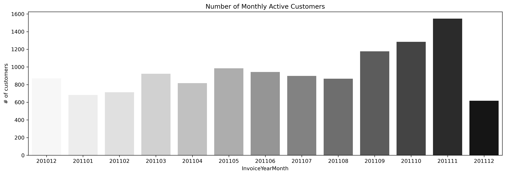
    


## 1.5 Monthly Orders


```python
tx_monthly_orders = tx_uk.groupby('InvoiceYearMonth')['InvoiceNo'].nunique().reset_index()
tx_monthly_orders.columns = ['InvoiceYearMonth', 'NumberOfOrders']
tx_monthly_orders
```


<div>
<style scoped>
    .dataframe tbody tr th:only-of-type {
        vertical-align: middle;
    }

    .dataframe tbody tr th {
        vertical-align: top;
    }

    .dataframe thead th {
        text-align: right;
    }
</style>
<table border="1" class="dataframe">
  <thead>
    <tr style="text-align: right;">
      <th></th>
      <th>InvoiceYearMonth</th>
      <th>NumberOfOrders</th>
    </tr>
  </thead>
  <tbody>
    <tr>
      <th>0</th>
      <td>201012</td>
      <td>1885</td>
    </tr>
    <tr>
      <th>1</th>
      <td>201101</td>
      <td>1327</td>
    </tr>
    <tr>
      <th>2</th>
      <td>201102</td>
      <td>1259</td>
    </tr>
    <tr>
      <th>3</th>
      <td>201103</td>
      <td>1802</td>
    </tr>
    <tr>
      <th>4</th>
      <td>201104</td>
      <td>1622</td>
    </tr>
    <tr>
      <th>5</th>
      <td>201105</td>
      <td>1973</td>
    </tr>
    <tr>
      <th>6</th>
      <td>201106</td>
      <td>1830</td>
    </tr>
    <tr>
      <th>7</th>
      <td>201107</td>
      <td>1764</td>
    </tr>
    <tr>
      <th>8</th>
      <td>201108</td>
      <td>1546</td>
    </tr>
    <tr>
      <th>9</th>
      <td>201109</td>
      <td>2090</td>
    </tr>
    <tr>
      <th>10</th>
      <td>201110</td>
      <td>2361</td>
    </tr>
    <tr>
      <th>11</th>
      <td>201111</td>
      <td>3113</td>
    </tr>
    <tr>
      <th>12</th>
      <td>201112</td>
      <td>922</td>
    </tr>
  </tbody>
</table>
</div>


As we expected, Number of Orders also declined in April (1802 to 1622, about 10% decrease.)
We know that Number of Active Customer directly affected Number of Orders decrease. At the end, we should definitely check our Average Revenue per Order as well.


```python
#tx_monthly_orders.plot(x='InvoiceYearMonth', y='NumberOfOrders',kind='bar',figsize=(16,5), legend=False)
#plt.title('Number of Monthly Orders')
plt.figure(figsize=[16,5],dpi = 300)
plt.title('Number of Monthly Orders')
sns.barplot(x='InvoiceYearMonth', y='NumberOfOrders', data=tx_monthly_orders, palette="Oranges")
plt.ylabel('Number of orders')
```


    Text(0, 0.5, 'Number of orders')


    
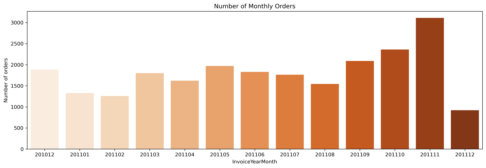
    


## 1.6 Monthly Average Revenue per Order


```python
tx_uk_monthly = tx_uk.groupby('InvoiceYearMonth')['Revenue'].sum().reset_index()
tx_monthly_order_avg = tx_uk_monthly.merge(tx_monthly_orders, on='InvoiceYearMonth', how='inner')
```


```python
tx_monthly_order_avg['AverageMonthlyRevenuePerOrder'] = round(tx_monthly_order_avg['Revenue']/tx_monthly_order_avg['NumberOfOrders'],2)
tx_monthly_order_avg
```


<div>
<style scoped>
    .dataframe tbody tr th:only-of-type {
        vertical-align: middle;
    }

    .dataframe tbody tr th {
        vertical-align: top;
    }

    .dataframe thead th {
        text-align: right;
    }
</style>
<table border="1" class="dataframe">
  <thead>
    <tr style="text-align: right;">
      <th></th>
      <th>InvoiceYearMonth</th>
      <th>Revenue</th>
      <th>NumberOfOrders</th>
      <th>AverageMonthlyRevenuePerOrder</th>
    </tr>
  </thead>
  <tbody>
    <tr>
      <th>0</th>
      <td>201012</td>
      <td>676742.620</td>
      <td>1885</td>
      <td>359.01</td>
    </tr>
    <tr>
      <th>1</th>
      <td>201101</td>
      <td>434308.300</td>
      <td>1327</td>
      <td>327.29</td>
    </tr>
    <tr>
      <th>2</th>
      <td>201102</td>
      <td>408247.910</td>
      <td>1259</td>
      <td>324.26</td>
    </tr>
    <tr>
      <th>3</th>
      <td>201103</td>
      <td>559707.390</td>
      <td>1802</td>
      <td>310.60</td>
    </tr>
    <tr>
      <th>4</th>
      <td>201104</td>
      <td>442254.041</td>
      <td>1622</td>
      <td>272.66</td>
    </tr>
    <tr>
      <th>5</th>
      <td>201105</td>
      <td>596459.860</td>
      <td>1973</td>
      <td>302.31</td>
    </tr>
    <tr>
      <th>6</th>
      <td>201106</td>
      <td>554478.350</td>
      <td>1830</td>
      <td>302.99</td>
    </tr>
    <tr>
      <th>7</th>
      <td>201107</td>
      <td>565479.841</td>
      <td>1764</td>
      <td>320.57</td>
    </tr>
    <tr>
      <th>8</th>
      <td>201108</td>
      <td>539130.500</td>
      <td>1546</td>
      <td>348.73</td>
    </tr>
    <tr>
      <th>9</th>
      <td>201109</td>
      <td>862018.152</td>
      <td>2090</td>
      <td>412.45</td>
    </tr>
    <tr>
      <th>10</th>
      <td>201110</td>
      <td>877438.190</td>
      <td>2361</td>
      <td>371.64</td>
    </tr>
    <tr>
      <th>11</th>
      <td>201111</td>
      <td>1282805.780</td>
      <td>3113</td>
      <td>412.08</td>
    </tr>
    <tr>
      <th>12</th>
      <td>201112</td>
      <td>388735.430</td>
      <td>922</td>
      <td>421.62</td>
    </tr>
  </tbody>
</table>
</div>


Even the monthly average revenue per order dropped for April (310 to 272).


```python
plt.figure(figsize=[16,5],dpi = 300)
plt.title('Monthly Average Revenue per Order')
sns.barplot(x='InvoiceYearMonth', y='AverageMonthlyRevenuePerOrder', data=tx_monthly_order_avg, palette="Blues_d")
plt.ylabel('Average Revenue')
#sns.catplot(x='InvoiceYearMonth', y='AverageMonthlyRevenuePerOrder', kind="bar", data=tx_monthly_order_avg)
#tx_monthly_order_avg.plot(x='InvoiceYearMonth', y='AverageMonthlyRevenuePerOrder',kind='bar',figsize=(16,5), legend=False)

```


    Text(0, 0.5, 'Average Revenue')


    

    


## 2. CUSTOMER METRICS

In this section, we are concerned about types of customers such as First-time and Returning Customers: their monthly number, revenue and so on.


```python
tx_min_purchase = tx_uk.groupby('CustomerID').InvoiceDate.min().reset_index()
```


```python
tx_min_purchase.columns = ['CustomerID','MinPurchaseDate']
```


```python
tx_min_purchase['MinPurchaseYearMonth'] = tx_min_purchase['MinPurchaseDate'].map(lambda date: 100*date.year + date.month)
```


```python
tx_uk = pd.merge(tx_uk, tx_min_purchase, on='CustomerID')
```


```python
tx_uk['UserType'] = 'First-time'
tx_uk['InvoiceYearMonth'] = tx_uk['InvoiceYearMonth'].astype(int)
tx_uk.loc[tx_uk['InvoiceYearMonth']>tx_uk['MinPurchaseYearMonth'],'UserType'] = 'Returning'
```

## 2.1 Number of customers by type


```python
tx_uk.groupby('UserType')['CustomerID'].nunique()
```


    UserType
    First-time    3950
    Returning     2530
    Name: CustomerID, dtype: int64


```python
tx_uk.head()
```


<div>
<style scoped>
    .dataframe tbody tr th:only-of-type {
        vertical-align: middle;
    }

    .dataframe tbody tr th {
        vertical-align: top;
    }

    .dataframe thead th {
        text-align: right;
    }
</style>
<table border="1" class="dataframe">
  <thead>
    <tr style="text-align: right;">
      <th></th>
      <th>InvoiceNo</th>
      <th>StockCode</th>
      <th>Description</th>
      <th>Quantity</th>
      <th>InvoiceDate</th>
      <th>UnitPrice</th>
      <th>CustomerID</th>
      <th>Country</th>
      <th>InvoiceYearMonth</th>
      <th>Revenue</th>
      <th>MinPurchaseDate</th>
      <th>MinPurchaseYearMonth</th>
      <th>UserType</th>
    </tr>
  </thead>
  <tbody>
    <tr>
      <th>0</th>
      <td>536365</td>
      <td>85123A</td>
      <td>WHITE HANGING HEART T-LIGHT HOLDER</td>
      <td>6</td>
      <td>2010-12-01 08:26:00</td>
      <td>2.55</td>
      <td>17850.0</td>
      <td>United Kingdom</td>
      <td>201012</td>
      <td>15.30</td>
      <td>2010-12-01 08:26:00</td>
      <td>201012</td>
      <td>First-time</td>
    </tr>
    <tr>
      <th>1</th>
      <td>536365</td>
      <td>71053</td>
      <td>WHITE METAL LANTERN</td>
      <td>6</td>
      <td>2010-12-01 08:26:00</td>
      <td>3.39</td>
      <td>17850.0</td>
      <td>United Kingdom</td>
      <td>201012</td>
      <td>20.34</td>
      <td>2010-12-01 08:26:00</td>
      <td>201012</td>
      <td>First-time</td>
    </tr>
    <tr>
      <th>2</th>
      <td>536365</td>
      <td>84406B</td>
      <td>CREAM CUPID HEARTS COAT HANGER</td>
      <td>8</td>
      <td>2010-12-01 08:26:00</td>
      <td>2.75</td>
      <td>17850.0</td>
      <td>United Kingdom</td>
      <td>201012</td>
      <td>22.00</td>
      <td>2010-12-01 08:26:00</td>
      <td>201012</td>
      <td>First-time</td>
    </tr>
    <tr>
      <th>3</th>
      <td>536365</td>
      <td>84029G</td>
      <td>KNITTED UNION FLAG HOT WATER BOTTLE</td>
      <td>6</td>
      <td>2010-12-01 08:26:00</td>
      <td>3.39</td>
      <td>17850.0</td>
      <td>United Kingdom</td>
      <td>201012</td>
      <td>20.34</td>
      <td>2010-12-01 08:26:00</td>
      <td>201012</td>
      <td>First-time</td>
    </tr>
    <tr>
      <th>4</th>
      <td>536365</td>
      <td>84029E</td>
      <td>RED WOOLLY HOTTIE WHITE HEART.</td>
      <td>6</td>
      <td>2010-12-01 08:26:00</td>
      <td>3.39</td>
      <td>17850.0</td>
      <td>United Kingdom</td>
      <td>201012</td>
      <td>20.34</td>
      <td>2010-12-01 08:26:00</td>
      <td>201012</td>
      <td>First-time</td>
    </tr>
  </tbody>
</table>
</div>


```python
tx_user_type_revenue = tx_uk.groupby(['InvoiceYearMonth','UserType'])['Revenue'].sum().reset_index()
tx_user_type_revenue['InvoiceYearMonth'] = tx_user_type_revenue['InvoiceYearMonth'].astype(str)
```

## 2.2 Revenue per month for new and existing customers


```python
tx_user_type_revenue.query("InvoiceYearMonth != 201012 and InvoiceYearMonth != 201112")
```


<div>
<style scoped>
    .dataframe tbody tr th:only-of-type {
        vertical-align: middle;
    }

    .dataframe tbody tr th {
        vertical-align: top;
    }

    .dataframe thead th {
        text-align: right;
    }
</style>
<table border="1" class="dataframe">
  <thead>
    <tr style="text-align: right;">
      <th></th>
      <th>InvoiceYearMonth</th>
      <th>UserType</th>
      <th>Revenue</th>
    </tr>
  </thead>
  <tbody>
    <tr>
      <th>0</th>
      <td>201012</td>
      <td>First-time</td>
      <td>483799.740</td>
    </tr>
    <tr>
      <th>1</th>
      <td>201101</td>
      <td>First-time</td>
      <td>156705.770</td>
    </tr>
    <tr>
      <th>2</th>
      <td>201101</td>
      <td>Returning</td>
      <td>195275.510</td>
    </tr>
    <tr>
      <th>3</th>
      <td>201102</td>
      <td>First-time</td>
      <td>127859.000</td>
    </tr>
    <tr>
      <th>4</th>
      <td>201102</td>
      <td>Returning</td>
      <td>220994.630</td>
    </tr>
    <tr>
      <th>5</th>
      <td>201103</td>
      <td>First-time</td>
      <td>160567.840</td>
    </tr>
    <tr>
      <th>6</th>
      <td>201103</td>
      <td>Returning</td>
      <td>296350.030</td>
    </tr>
    <tr>
      <th>7</th>
      <td>201104</td>
      <td>First-time</td>
      <td>108517.751</td>
    </tr>
    <tr>
      <th>8</th>
      <td>201104</td>
      <td>Returning</td>
      <td>268226.660</td>
    </tr>
    <tr>
      <th>9</th>
      <td>201105</td>
      <td>First-time</td>
      <td>90847.490</td>
    </tr>
    <tr>
      <th>10</th>
      <td>201105</td>
      <td>Returning</td>
      <td>434725.860</td>
    </tr>
    <tr>
      <th>11</th>
      <td>201106</td>
      <td>First-time</td>
      <td>64479.190</td>
    </tr>
    <tr>
      <th>12</th>
      <td>201106</td>
      <td>Returning</td>
      <td>408030.060</td>
    </tr>
    <tr>
      <th>13</th>
      <td>201107</td>
      <td>First-time</td>
      <td>53453.991</td>
    </tr>
    <tr>
      <th>14</th>
      <td>201107</td>
      <td>Returning</td>
      <td>407693.610</td>
    </tr>
    <tr>
      <th>15</th>
      <td>201108</td>
      <td>First-time</td>
      <td>55619.480</td>
    </tr>
    <tr>
      <th>16</th>
      <td>201108</td>
      <td>Returning</td>
      <td>421388.930</td>
    </tr>
    <tr>
      <th>17</th>
      <td>201109</td>
      <td>First-time</td>
      <td>135667.941</td>
    </tr>
    <tr>
      <th>18</th>
      <td>201109</td>
      <td>Returning</td>
      <td>640861.901</td>
    </tr>
    <tr>
      <th>19</th>
      <td>201110</td>
      <td>First-time</td>
      <td>133940.280</td>
    </tr>
    <tr>
      <th>20</th>
      <td>201110</td>
      <td>Returning</td>
      <td>648837.600</td>
    </tr>
    <tr>
      <th>21</th>
      <td>201111</td>
      <td>First-time</td>
      <td>117153.750</td>
    </tr>
    <tr>
      <th>22</th>
      <td>201111</td>
      <td>Returning</td>
      <td>838955.910</td>
    </tr>
    <tr>
      <th>23</th>
      <td>201112</td>
      <td>First-time</td>
      <td>24447.810</td>
    </tr>
    <tr>
      <th>24</th>
      <td>201112</td>
      <td>Returning</td>
      <td>273472.660</td>
    </tr>
  </tbody>
</table>
</div>


```python
plt.figure(figsize=[16,5], dpi = 300)
sns.lineplot(data=tx_user_type_revenue, x="InvoiceYearMonth", y="Revenue", hue="UserType", style="UserType")
plt.title('Monthly Revenue for First-time and Returning Customers')
```


    Text(0.5, 1.0, 'Monthly Revenue for First-time and Returning Customers')


    

    


#### Number of First-time Customers by Month


```python
tx_uk.query("UserType == 'First-time'").groupby(['InvoiceYearMonth'])['CustomerID'].nunique()
```


    InvoiceYearMonth
    201012    871
    201101    362
    201102    339
    201103    408
    201104    276
    201105    252
    201106    207
    201107    172
    201108    140
    201109    275
    201110    318
    201111    296
    201112     34
    Name: CustomerID, dtype: int64


#### Number of Returning Customers by Month


```python
tx_uk.query("UserType == 'Returning'").groupby(['InvoiceYearMonth'])['CustomerID'].nunique()
```


    InvoiceYearMonth
    201101     322
    201102     375
    201103     515
    201104     541
    201105     733
    201106     736
    201107     727
    201108     727
    201109     902
    201110     967
    201111    1252
    201112     583
    Name: CustomerID, dtype: int64


## 2.3. Customer Signup Date


```python
tx_min_purchase.head()
```


<div>
<style scoped>
    .dataframe tbody tr th:only-of-type {
        vertical-align: middle;
    }

    .dataframe tbody tr th {
        vertical-align: top;
    }

    .dataframe thead th {
        text-align: right;
    }
</style>
<table border="1" class="dataframe">
  <thead>
    <tr style="text-align: right;">
      <th></th>
      <th>CustomerID</th>
      <th>MinPurchaseDate</th>
      <th>MinPurchaseYearMonth</th>
    </tr>
  </thead>
  <tbody>
    <tr>
      <th>0</th>
      <td>12346.0</td>
      <td>2011-01-18 10:01:00</td>
      <td>201101</td>
    </tr>
    <tr>
      <th>1</th>
      <td>12747.0</td>
      <td>2010-12-05 15:38:00</td>
      <td>201012</td>
    </tr>
    <tr>
      <th>2</th>
      <td>12748.0</td>
      <td>2010-12-01 12:48:00</td>
      <td>201012</td>
    </tr>
    <tr>
      <th>3</th>
      <td>12749.0</td>
      <td>2011-05-10 15:25:00</td>
      <td>201105</td>
    </tr>
    <tr>
      <th>4</th>
      <td>12820.0</td>
      <td>2011-01-17 12:34:00</td>
      <td>201101</td>
    </tr>
  </tbody>
</table>
</div>


```python
unq_month_year =  tx_min_purchase.MinPurchaseYearMonth.unique()
```


```python
def generate_signup_date(year_month):
    signup_date = [el for el in unq_month_year if year_month >= el]
    return np.random.choice(signup_date)
```


```python
tx_min_purchase['SignupYearMonth'] = tx_min_purchase.apply(lambda row: generate_signup_date(row['MinPurchaseYearMonth']),axis=1)
```


```python
tx_min_purchase['InstallYearMonth'] = tx_min_purchase.apply(lambda row: generate_signup_date(row['SignupYearMonth']),axis=1)
```


```python
tx_min_purchase.head()
```


<div>
<style scoped>
    .dataframe tbody tr th:only-of-type {
        vertical-align: middle;
    }

    .dataframe tbody tr th {
        vertical-align: top;
    }

    .dataframe thead th {
        text-align: right;
    }
</style>
<table border="1" class="dataframe">
  <thead>
    <tr style="text-align: right;">
      <th></th>
      <th>CustomerID</th>
      <th>MinPurchaseDate</th>
      <th>MinPurchaseYearMonth</th>
      <th>SignupYearMonth</th>
      <th>InstallYearMonth</th>
    </tr>
  </thead>
  <tbody>
    <tr>
      <th>0</th>
      <td>12346.0</td>
      <td>2011-01-18 10:01:00</td>
      <td>201101</td>
      <td>201012</td>
      <td>201012</td>
    </tr>
    <tr>
      <th>1</th>
      <td>12747.0</td>
      <td>2010-12-05 15:38:00</td>
      <td>201012</td>
      <td>201012</td>
      <td>201012</td>
    </tr>
    <tr>
      <th>2</th>
      <td>12748.0</td>
      <td>2010-12-01 12:48:00</td>
      <td>201012</td>
      <td>201012</td>
      <td>201012</td>
    </tr>
    <tr>
      <th>3</th>
      <td>12749.0</td>
      <td>2011-05-10 15:25:00</td>
      <td>201105</td>
      <td>201103</td>
      <td>201102</td>
    </tr>
    <tr>
      <th>4</th>
      <td>12820.0</td>
      <td>2011-01-17 12:34:00</td>
      <td>201101</td>
      <td>201012</td>
      <td>201012</td>
    </tr>
  </tbody>
</table>
</div>


## 2.4 Monthly Retention Rate

Retention rate should be monitored very closely because it indicates how sticky is your service and how well the product fits the market. 

For making Monthly Retention Rate visualized, we need to calculate how many customers retained from previous month.


Monthly Retention Rate = Retained Customers From Prev. Month / Total Active Customers


```python
tx_uk.head()
```


<div>
<style scoped>
    .dataframe tbody tr th:only-of-type {
        vertical-align: middle;
    }

    .dataframe tbody tr th {
        vertical-align: top;
    }

    .dataframe thead th {
        text-align: right;
    }
</style>
<table border="1" class="dataframe">
  <thead>
    <tr style="text-align: right;">
      <th></th>
      <th>InvoiceNo</th>
      <th>StockCode</th>
      <th>Description</th>
      <th>Quantity</th>
      <th>InvoiceDate</th>
      <th>UnitPrice</th>
      <th>CustomerID</th>
      <th>Country</th>
      <th>InvoiceYearMonth</th>
      <th>Revenue</th>
      <th>MinPurchaseDate</th>
      <th>MinPurchaseYearMonth</th>
      <th>UserType</th>
    </tr>
  </thead>
  <tbody>
    <tr>
      <th>0</th>
      <td>536365</td>
      <td>85123A</td>
      <td>WHITE HANGING HEART T-LIGHT HOLDER</td>
      <td>6</td>
      <td>2010-12-01 08:26:00</td>
      <td>2.55</td>
      <td>17850.0</td>
      <td>United Kingdom</td>
      <td>201012</td>
      <td>15.30</td>
      <td>2010-12-01 08:26:00</td>
      <td>201012</td>
      <td>First-time</td>
    </tr>
    <tr>
      <th>1</th>
      <td>536365</td>
      <td>71053</td>
      <td>WHITE METAL LANTERN</td>
      <td>6</td>
      <td>2010-12-01 08:26:00</td>
      <td>3.39</td>
      <td>17850.0</td>
      <td>United Kingdom</td>
      <td>201012</td>
      <td>20.34</td>
      <td>2010-12-01 08:26:00</td>
      <td>201012</td>
      <td>First-time</td>
    </tr>
    <tr>
      <th>2</th>
      <td>536365</td>
      <td>84406B</td>
      <td>CREAM CUPID HEARTS COAT HANGER</td>
      <td>8</td>
      <td>2010-12-01 08:26:00</td>
      <td>2.75</td>
      <td>17850.0</td>
      <td>United Kingdom</td>
      <td>201012</td>
      <td>22.00</td>
      <td>2010-12-01 08:26:00</td>
      <td>201012</td>
      <td>First-time</td>
    </tr>
    <tr>
      <th>3</th>
      <td>536365</td>
      <td>84029G</td>
      <td>KNITTED UNION FLAG HOT WATER BOTTLE</td>
      <td>6</td>
      <td>2010-12-01 08:26:00</td>
      <td>3.39</td>
      <td>17850.0</td>
      <td>United Kingdom</td>
      <td>201012</td>
      <td>20.34</td>
      <td>2010-12-01 08:26:00</td>
      <td>201012</td>
      <td>First-time</td>
    </tr>
    <tr>
      <th>4</th>
      <td>536365</td>
      <td>84029E</td>
      <td>RED WOOLLY HOTTIE WHITE HEART.</td>
      <td>6</td>
      <td>2010-12-01 08:26:00</td>
      <td>3.39</td>
      <td>17850.0</td>
      <td>United Kingdom</td>
      <td>201012</td>
      <td>20.34</td>
      <td>2010-12-01 08:26:00</td>
      <td>201012</td>
      <td>First-time</td>
    </tr>
  </tbody>
</table>
</div>


```python
df_monthly_active = tx_uk.groupby('InvoiceYearMonth')['CustomerID'].nunique().reset_index()
```


```python
tx_user_purchase = tx_uk.groupby(['CustomerID','InvoiceYearMonth'])['Revenue'].sum().astype(int).reset_index()
```


```python
tx_user_purchase
```


<div>
<style scoped>
    .dataframe tbody tr th:only-of-type {
        vertical-align: middle;
    }

    .dataframe tbody tr th {
        vertical-align: top;
    }

    .dataframe thead th {
        text-align: right;
    }
</style>
<table border="1" class="dataframe">
  <thead>
    <tr style="text-align: right;">
      <th></th>
      <th>CustomerID</th>
      <th>InvoiceYearMonth</th>
      <th>Revenue</th>
    </tr>
  </thead>
  <tbody>
    <tr>
      <th>0</th>
      <td>12346.0</td>
      <td>201101</td>
      <td>0</td>
    </tr>
    <tr>
      <th>1</th>
      <td>12747.0</td>
      <td>201012</td>
      <td>706</td>
    </tr>
    <tr>
      <th>2</th>
      <td>12747.0</td>
      <td>201101</td>
      <td>303</td>
    </tr>
    <tr>
      <th>3</th>
      <td>12747.0</td>
      <td>201103</td>
      <td>310</td>
    </tr>
    <tr>
      <th>4</th>
      <td>12747.0</td>
      <td>201105</td>
      <td>771</td>
    </tr>
    <tr>
      <th>...</th>
      <td>...</td>
      <td>...</td>
      <td>...</td>
    </tr>
    <tr>
      <th>12325</th>
      <td>18283.0</td>
      <td>201110</td>
      <td>114</td>
    </tr>
    <tr>
      <th>12326</th>
      <td>18283.0</td>
      <td>201111</td>
      <td>651</td>
    </tr>
    <tr>
      <th>12327</th>
      <td>18283.0</td>
      <td>201112</td>
      <td>208</td>
    </tr>
    <tr>
      <th>12328</th>
      <td>18287.0</td>
      <td>201105</td>
      <td>765</td>
    </tr>
    <tr>
      <th>12329</th>
      <td>18287.0</td>
      <td>201110</td>
      <td>1072</td>
    </tr>
  </tbody>
</table>
<p>12330 rows × 3 columns</p>
</div>


```python
tx_retention = pd.crosstab(tx_user_purchase['CustomerID'], tx_user_purchase['InvoiceYearMonth']).reset_index()
```


```python
tx_retention.head()
```


<div>
<style scoped>
    .dataframe tbody tr th:only-of-type {
        vertical-align: middle;
    }

    .dataframe tbody tr th {
        vertical-align: top;
    }

    .dataframe thead th {
        text-align: right;
    }
</style>
<table border="1" class="dataframe">
  <thead>
    <tr style="text-align: right;">
      <th>InvoiceYearMonth</th>
      <th>CustomerID</th>
      <th>201012</th>
      <th>201101</th>
      <th>201102</th>
      <th>201103</th>
      <th>201104</th>
      <th>201105</th>
      <th>201106</th>
      <th>201107</th>
      <th>201108</th>
      <th>201109</th>
      <th>201110</th>
      <th>201111</th>
      <th>201112</th>
    </tr>
  </thead>
  <tbody>
    <tr>
      <th>0</th>
      <td>12346.0</td>
      <td>0</td>
      <td>1</td>
      <td>0</td>
      <td>0</td>
      <td>0</td>
      <td>0</td>
      <td>0</td>
      <td>0</td>
      <td>0</td>
      <td>0</td>
      <td>0</td>
      <td>0</td>
      <td>0</td>
    </tr>
    <tr>
      <th>1</th>
      <td>12747.0</td>
      <td>1</td>
      <td>1</td>
      <td>0</td>
      <td>1</td>
      <td>0</td>
      <td>1</td>
      <td>1</td>
      <td>0</td>
      <td>1</td>
      <td>0</td>
      <td>1</td>
      <td>1</td>
      <td>1</td>
    </tr>
    <tr>
      <th>2</th>
      <td>12748.0</td>
      <td>1</td>
      <td>1</td>
      <td>1</td>
      <td>1</td>
      <td>1</td>
      <td>1</td>
      <td>1</td>
      <td>1</td>
      <td>1</td>
      <td>1</td>
      <td>1</td>
      <td>1</td>
      <td>1</td>
    </tr>
    <tr>
      <th>3</th>
      <td>12749.0</td>
      <td>0</td>
      <td>0</td>
      <td>0</td>
      <td>0</td>
      <td>0</td>
      <td>1</td>
      <td>0</td>
      <td>0</td>
      <td>1</td>
      <td>0</td>
      <td>0</td>
      <td>1</td>
      <td>1</td>
    </tr>
    <tr>
      <th>4</th>
      <td>12820.0</td>
      <td>0</td>
      <td>1</td>
      <td>0</td>
      <td>0</td>
      <td>0</td>
      <td>0</td>
      <td>0</td>
      <td>0</td>
      <td>0</td>
      <td>1</td>
      <td>1</td>
      <td>0</td>
      <td>1</td>
    </tr>
  </tbody>
</table>
</div>


```python
months = tx_retention.columns[2:]
```


```python
months
```


    Index([201101, 201102, 201103, 201104, 201105, 201106, 201107, 201108, 201109,
           201110, 201111, 201112],
          dtype='object', name='InvoiceYearMonth')


```python
retention_array = []
for i in range(len(months)-1):
    retention_data = {}
    selected_month = months[i+1]
    prev_month = months[i]
    retention_data['InvoiceYearMonth'] = int(selected_month)
    retention_data['TotalUserCount'] = tx_retention[selected_month].sum()
    retention_data['RetainedUserCount'] = tx_retention[(tx_retention[selected_month]>0) & (tx_retention[prev_month]>0)][selected_month].sum()
    retention_array.append(retention_data)
```


```python
tx_retention = pd.DataFrame(retention_array)
```


```python
tx_retention.head()
```


<div>
<style scoped>
    .dataframe tbody tr th:only-of-type {
        vertical-align: middle;
    }

    .dataframe tbody tr th {
        vertical-align: top;
    }

    .dataframe thead th {
        text-align: right;
    }
</style>
<table border="1" class="dataframe">
  <thead>
    <tr style="text-align: right;">
      <th></th>
      <th>InvoiceYearMonth</th>
      <th>TotalUserCount</th>
      <th>RetainedUserCount</th>
    </tr>
  </thead>
  <tbody>
    <tr>
      <th>0</th>
      <td>201102</td>
      <td>714</td>
      <td>263</td>
    </tr>
    <tr>
      <th>1</th>
      <td>201103</td>
      <td>923</td>
      <td>305</td>
    </tr>
    <tr>
      <th>2</th>
      <td>201104</td>
      <td>817</td>
      <td>310</td>
    </tr>
    <tr>
      <th>3</th>
      <td>201105</td>
      <td>985</td>
      <td>369</td>
    </tr>
    <tr>
      <th>4</th>
      <td>201106</td>
      <td>943</td>
      <td>417</td>
    </tr>
  </tbody>
</table>
</div>


```python
tx_retention['RetentionRate'] = round(tx_retention['RetainedUserCount']/tx_retention['TotalUserCount'],1)
```


```python
tx_retention
```


<div>
<style scoped>
    .dataframe tbody tr th:only-of-type {
        vertical-align: middle;
    }

    .dataframe tbody tr th {
        vertical-align: top;
    }

    .dataframe thead th {
        text-align: right;
    }
</style>
<table border="1" class="dataframe">
  <thead>
    <tr style="text-align: right;">
      <th></th>
      <th>InvoiceYearMonth</th>
      <th>TotalUserCount</th>
      <th>RetainedUserCount</th>
      <th>RetentionRate</th>
    </tr>
  </thead>
  <tbody>
    <tr>
      <th>0</th>
      <td>201102</td>
      <td>714</td>
      <td>263</td>
      <td>0.4</td>
    </tr>
    <tr>
      <th>1</th>
      <td>201103</td>
      <td>923</td>
      <td>305</td>
      <td>0.3</td>
    </tr>
    <tr>
      <th>2</th>
      <td>201104</td>
      <td>817</td>
      <td>310</td>
      <td>0.4</td>
    </tr>
    <tr>
      <th>3</th>
      <td>201105</td>
      <td>985</td>
      <td>369</td>
      <td>0.4</td>
    </tr>
    <tr>
      <th>4</th>
      <td>201106</td>
      <td>943</td>
      <td>417</td>
      <td>0.4</td>
    </tr>
    <tr>
      <th>5</th>
      <td>201107</td>
      <td>899</td>
      <td>379</td>
      <td>0.4</td>
    </tr>
    <tr>
      <th>6</th>
      <td>201108</td>
      <td>867</td>
      <td>391</td>
      <td>0.5</td>
    </tr>
    <tr>
      <th>7</th>
      <td>201109</td>
      <td>1177</td>
      <td>417</td>
      <td>0.4</td>
    </tr>
    <tr>
      <th>8</th>
      <td>201110</td>
      <td>1285</td>
      <td>502</td>
      <td>0.4</td>
    </tr>
    <tr>
      <th>9</th>
      <td>201111</td>
      <td>1548</td>
      <td>616</td>
      <td>0.4</td>
    </tr>
    <tr>
      <th>10</th>
      <td>201112</td>
      <td>617</td>
      <td>402</td>
      <td>0.7</td>
    </tr>
  </tbody>
</table>
</div>


Monthly Retention Rate significantly jumped from June to August and went back to previous levels afterwards.


```python
txx_retention = tx_retention.copy()
txx_retention['InvoiceYearMonth'] = txx_retention['InvoiceYearMonth'].astype(str)
plt.figure(figsize=[16,5], dpi = 300)
sns.lineplot(data=txx_retention, x="InvoiceYearMonth", y="RetentionRate")
plt.ylim([0,0.8])
plt.title('Monthly Retention Rate')
```


    Text(0.5, 1.0, 'Monthly Retention Rate')


    
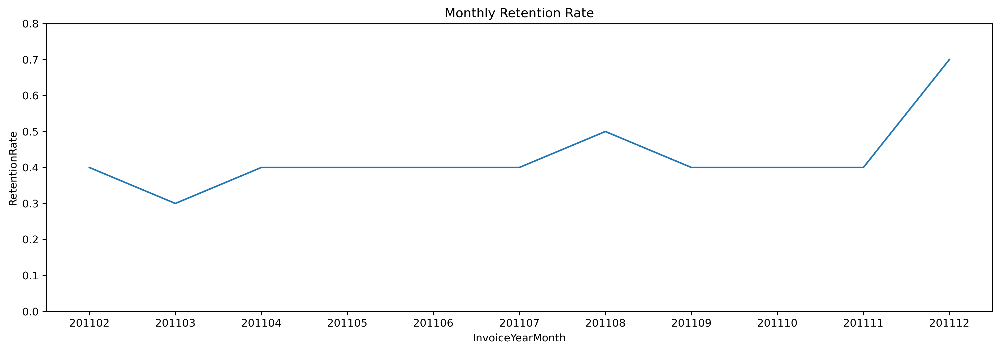
    


## 2.5 Churn Rate

Churn rate refers to the percentange of customers from the preevious month that do not purchase in the next month.

To make it easier, i define the timeline for churn to be the previous month, so that

        churn rate + retention rate = 1
        
Hence,

        churn rate = 1 - retention rate


```python
txx_retention['ChurnRate'] =  1 - tx_retention['RetentionRate']
txx_retention
```


<div>
<style scoped>
    .dataframe tbody tr th:only-of-type {
        vertical-align: middle;
    }

    .dataframe tbody tr th {
        vertical-align: top;
    }

    .dataframe thead th {
        text-align: right;
    }
</style>
<table border="1" class="dataframe">
  <thead>
    <tr style="text-align: right;">
      <th></th>
      <th>InvoiceYearMonth</th>
      <th>TotalUserCount</th>
      <th>RetainedUserCount</th>
      <th>RetentionRate</th>
      <th>ChurnRate</th>
    </tr>
  </thead>
  <tbody>
    <tr>
      <th>0</th>
      <td>201102</td>
      <td>714</td>
      <td>263</td>
      <td>0.4</td>
      <td>0.6</td>
    </tr>
    <tr>
      <th>1</th>
      <td>201103</td>
      <td>923</td>
      <td>305</td>
      <td>0.3</td>
      <td>0.7</td>
    </tr>
    <tr>
      <th>2</th>
      <td>201104</td>
      <td>817</td>
      <td>310</td>
      <td>0.4</td>
      <td>0.6</td>
    </tr>
    <tr>
      <th>3</th>
      <td>201105</td>
      <td>985</td>
      <td>369</td>
      <td>0.4</td>
      <td>0.6</td>
    </tr>
    <tr>
      <th>4</th>
      <td>201106</td>
      <td>943</td>
      <td>417</td>
      <td>0.4</td>
      <td>0.6</td>
    </tr>
    <tr>
      <th>5</th>
      <td>201107</td>
      <td>899</td>
      <td>379</td>
      <td>0.4</td>
      <td>0.6</td>
    </tr>
    <tr>
      <th>6</th>
      <td>201108</td>
      <td>867</td>
      <td>391</td>
      <td>0.5</td>
      <td>0.5</td>
    </tr>
    <tr>
      <th>7</th>
      <td>201109</td>
      <td>1177</td>
      <td>417</td>
      <td>0.4</td>
      <td>0.6</td>
    </tr>
    <tr>
      <th>8</th>
      <td>201110</td>
      <td>1285</td>
      <td>502</td>
      <td>0.4</td>
      <td>0.6</td>
    </tr>
    <tr>
      <th>9</th>
      <td>201111</td>
      <td>1548</td>
      <td>616</td>
      <td>0.4</td>
      <td>0.6</td>
    </tr>
    <tr>
      <th>10</th>
      <td>201112</td>
      <td>617</td>
      <td>402</td>
      <td>0.7</td>
      <td>0.3</td>
    </tr>
  </tbody>
</table>
</div>


```python
plt.figure(figsize=[16,5], dpi = 300)
sns.lineplot(data=txx_retention, x="InvoiceYearMonth", y="ChurnRate", color='green')
plt.ylim([0, 0.8])
plt.title('Monthly Churn Rate')
```


    Text(0.5, 1.0, 'Monthly Churn Rate')


    
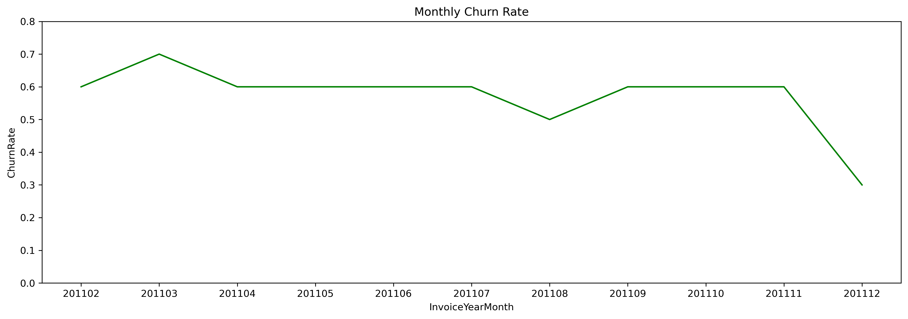
    


## 2.6 Cohort-Based Retention Rate

There is another way of measuring Retention Rate which allows us to see Retention Rate for each cohort. Cohorts are determined as first purchase year-month of the customers. We will be measuring what percentage of the customers retained after their first purchase in each month. This view will help us to see how recent and old cohorts differ regarding retention rate and if recent changes in customer experience affected new customer’s retention or not.


```python
tx_user_purchase.head()
```


<div>
<style scoped>
    .dataframe tbody tr th:only-of-type {
        vertical-align: middle;
    }

    .dataframe tbody tr th {
        vertical-align: top;
    }

    .dataframe thead th {
        text-align: right;
    }
</style>
<table border="1" class="dataframe">
  <thead>
    <tr style="text-align: right;">
      <th></th>
      <th>CustomerID</th>
      <th>InvoiceYearMonth</th>
      <th>Revenue</th>
    </tr>
  </thead>
  <tbody>
    <tr>
      <th>0</th>
      <td>12346.0</td>
      <td>201101</td>
      <td>0</td>
    </tr>
    <tr>
      <th>1</th>
      <td>12747.0</td>
      <td>201012</td>
      <td>706</td>
    </tr>
    <tr>
      <th>2</th>
      <td>12747.0</td>
      <td>201101</td>
      <td>303</td>
    </tr>
    <tr>
      <th>3</th>
      <td>12747.0</td>
      <td>201103</td>
      <td>310</td>
    </tr>
    <tr>
      <th>4</th>
      <td>12747.0</td>
      <td>201105</td>
      <td>771</td>
    </tr>
  </tbody>
</table>
</div>


```python
tx_min_purchase.head()
```


<div>
<style scoped>
    .dataframe tbody tr th:only-of-type {
        vertical-align: middle;
    }

    .dataframe tbody tr th {
        vertical-align: top;
    }

    .dataframe thead th {
        text-align: right;
    }
</style>
<table border="1" class="dataframe">
  <thead>
    <tr style="text-align: right;">
      <th></th>
      <th>CustomerID</th>
      <th>MinPurchaseDate</th>
      <th>MinPurchaseYearMonth</th>
      <th>SignupYearMonth</th>
      <th>InstallYearMonth</th>
    </tr>
  </thead>
  <tbody>
    <tr>
      <th>0</th>
      <td>12346.0</td>
      <td>2011-01-18 10:01:00</td>
      <td>201101</td>
      <td>201012</td>
      <td>201012</td>
    </tr>
    <tr>
      <th>1</th>
      <td>12747.0</td>
      <td>2010-12-05 15:38:00</td>
      <td>201012</td>
      <td>201012</td>
      <td>201012</td>
    </tr>
    <tr>
      <th>2</th>
      <td>12748.0</td>
      <td>2010-12-01 12:48:00</td>
      <td>201012</td>
      <td>201012</td>
      <td>201012</td>
    </tr>
    <tr>
      <th>3</th>
      <td>12749.0</td>
      <td>2011-05-10 15:25:00</td>
      <td>201105</td>
      <td>201103</td>
      <td>201102</td>
    </tr>
    <tr>
      <th>4</th>
      <td>12820.0</td>
      <td>2011-01-17 12:34:00</td>
      <td>201101</td>
      <td>201012</td>
      <td>201012</td>
    </tr>
  </tbody>
</table>
</div>


```python
tx_retention = pd.crosstab(tx_user_purchase['CustomerID'], tx_user_purchase['InvoiceYearMonth']).reset_index()
```


```python
tx_retention = pd.merge(tx_retention, tx_min_purchase[['CustomerID','MinPurchaseYearMonth']], on='CustomerID')
```


```python
tx_retention.head()
```


<div>
<style scoped>
    .dataframe tbody tr th:only-of-type {
        vertical-align: middle;
    }

    .dataframe tbody tr th {
        vertical-align: top;
    }

    .dataframe thead th {
        text-align: right;
    }
</style>
<table border="1" class="dataframe">
  <thead>
    <tr style="text-align: right;">
      <th></th>
      <th>CustomerID</th>
      <th>201012</th>
      <th>201101</th>
      <th>201102</th>
      <th>201103</th>
      <th>201104</th>
      <th>201105</th>
      <th>201106</th>
      <th>201107</th>
      <th>201108</th>
      <th>201109</th>
      <th>201110</th>
      <th>201111</th>
      <th>201112</th>
      <th>MinPurchaseYearMonth</th>
    </tr>
  </thead>
  <tbody>
    <tr>
      <th>0</th>
      <td>12346.0</td>
      <td>0</td>
      <td>1</td>
      <td>0</td>
      <td>0</td>
      <td>0</td>
      <td>0</td>
      <td>0</td>
      <td>0</td>
      <td>0</td>
      <td>0</td>
      <td>0</td>
      <td>0</td>
      <td>0</td>
      <td>201101</td>
    </tr>
    <tr>
      <th>1</th>
      <td>12747.0</td>
      <td>1</td>
      <td>1</td>
      <td>0</td>
      <td>1</td>
      <td>0</td>
      <td>1</td>
      <td>1</td>
      <td>0</td>
      <td>1</td>
      <td>0</td>
      <td>1</td>
      <td>1</td>
      <td>1</td>
      <td>201012</td>
    </tr>
    <tr>
      <th>2</th>
      <td>12748.0</td>
      <td>1</td>
      <td>1</td>
      <td>1</td>
      <td>1</td>
      <td>1</td>
      <td>1</td>
      <td>1</td>
      <td>1</td>
      <td>1</td>
      <td>1</td>
      <td>1</td>
      <td>1</td>
      <td>1</td>
      <td>201012</td>
    </tr>
    <tr>
      <th>3</th>
      <td>12749.0</td>
      <td>0</td>
      <td>0</td>
      <td>0</td>
      <td>0</td>
      <td>0</td>
      <td>1</td>
      <td>0</td>
      <td>0</td>
      <td>1</td>
      <td>0</td>
      <td>0</td>
      <td>1</td>
      <td>1</td>
      <td>201105</td>
    </tr>
    <tr>
      <th>4</th>
      <td>12820.0</td>
      <td>0</td>
      <td>1</td>
      <td>0</td>
      <td>0</td>
      <td>0</td>
      <td>0</td>
      <td>0</td>
      <td>0</td>
      <td>0</td>
      <td>1</td>
      <td>1</td>
      <td>0</td>
      <td>1</td>
      <td>201101</td>
    </tr>
  </tbody>
</table>
</div>


```python
new_column_names = [ 'm_' + str(column) for column in tx_retention.columns[:-1]]
new_column_names.append('MinPurchaseYearMonth')
```


```python
tx_retention.columns = new_column_names
```


```python
tx_retention
```


<div>
<style scoped>
    .dataframe tbody tr th:only-of-type {
        vertical-align: middle;
    }

    .dataframe tbody tr th {
        vertical-align: top;
    }

    .dataframe thead th {
        text-align: right;
    }
</style>
<table border="1" class="dataframe">
  <thead>
    <tr style="text-align: right;">
      <th></th>
      <th>m_CustomerID</th>
      <th>m_201012</th>
      <th>m_201101</th>
      <th>m_201102</th>
      <th>m_201103</th>
      <th>m_201104</th>
      <th>m_201105</th>
      <th>m_201106</th>
      <th>m_201107</th>
      <th>m_201108</th>
      <th>m_201109</th>
      <th>m_201110</th>
      <th>m_201111</th>
      <th>m_201112</th>
      <th>MinPurchaseYearMonth</th>
    </tr>
  </thead>
  <tbody>
    <tr>
      <th>0</th>
      <td>12346.0</td>
      <td>0</td>
      <td>1</td>
      <td>0</td>
      <td>0</td>
      <td>0</td>
      <td>0</td>
      <td>0</td>
      <td>0</td>
      <td>0</td>
      <td>0</td>
      <td>0</td>
      <td>0</td>
      <td>0</td>
      <td>201101</td>
    </tr>
    <tr>
      <th>1</th>
      <td>12747.0</td>
      <td>1</td>
      <td>1</td>
      <td>0</td>
      <td>1</td>
      <td>0</td>
      <td>1</td>
      <td>1</td>
      <td>0</td>
      <td>1</td>
      <td>0</td>
      <td>1</td>
      <td>1</td>
      <td>1</td>
      <td>201012</td>
    </tr>
    <tr>
      <th>2</th>
      <td>12748.0</td>
      <td>1</td>
      <td>1</td>
      <td>1</td>
      <td>1</td>
      <td>1</td>
      <td>1</td>
      <td>1</td>
      <td>1</td>
      <td>1</td>
      <td>1</td>
      <td>1</td>
      <td>1</td>
      <td>1</td>
      <td>201012</td>
    </tr>
    <tr>
      <th>3</th>
      <td>12749.0</td>
      <td>0</td>
      <td>0</td>
      <td>0</td>
      <td>0</td>
      <td>0</td>
      <td>1</td>
      <td>0</td>
      <td>0</td>
      <td>1</td>
      <td>0</td>
      <td>0</td>
      <td>1</td>
      <td>1</td>
      <td>201105</td>
    </tr>
    <tr>
      <th>4</th>
      <td>12820.0</td>
      <td>0</td>
      <td>1</td>
      <td>0</td>
      <td>0</td>
      <td>0</td>
      <td>0</td>
      <td>0</td>
      <td>0</td>
      <td>0</td>
      <td>1</td>
      <td>1</td>
      <td>0</td>
      <td>1</td>
      <td>201101</td>
    </tr>
    <tr>
      <th>...</th>
      <td>...</td>
      <td>...</td>
      <td>...</td>
      <td>...</td>
      <td>...</td>
      <td>...</td>
      <td>...</td>
      <td>...</td>
      <td>...</td>
      <td>...</td>
      <td>...</td>
      <td>...</td>
      <td>...</td>
      <td>...</td>
      <td>...</td>
    </tr>
    <tr>
      <th>3945</th>
      <td>18280.0</td>
      <td>0</td>
      <td>0</td>
      <td>0</td>
      <td>1</td>
      <td>0</td>
      <td>0</td>
      <td>0</td>
      <td>0</td>
      <td>0</td>
      <td>0</td>
      <td>0</td>
      <td>0</td>
      <td>0</td>
      <td>201103</td>
    </tr>
    <tr>
      <th>3946</th>
      <td>18281.0</td>
      <td>0</td>
      <td>0</td>
      <td>0</td>
      <td>0</td>
      <td>0</td>
      <td>0</td>
      <td>1</td>
      <td>0</td>
      <td>0</td>
      <td>0</td>
      <td>0</td>
      <td>0</td>
      <td>0</td>
      <td>201106</td>
    </tr>
    <tr>
      <th>3947</th>
      <td>18282.0</td>
      <td>0</td>
      <td>0</td>
      <td>0</td>
      <td>0</td>
      <td>0</td>
      <td>0</td>
      <td>0</td>
      <td>0</td>
      <td>1</td>
      <td>0</td>
      <td>0</td>
      <td>0</td>
      <td>1</td>
      <td>201108</td>
    </tr>
    <tr>
      <th>3948</th>
      <td>18283.0</td>
      <td>0</td>
      <td>1</td>
      <td>1</td>
      <td>0</td>
      <td>1</td>
      <td>1</td>
      <td>1</td>
      <td>1</td>
      <td>0</td>
      <td>1</td>
      <td>1</td>
      <td>1</td>
      <td>1</td>
      <td>201101</td>
    </tr>
    <tr>
      <th>3949</th>
      <td>18287.0</td>
      <td>0</td>
      <td>0</td>
      <td>0</td>
      <td>0</td>
      <td>0</td>
      <td>1</td>
      <td>0</td>
      <td>0</td>
      <td>0</td>
      <td>0</td>
      <td>1</td>
      <td>0</td>
      <td>0</td>
      <td>201105</td>
    </tr>
  </tbody>
</table>
<p>3950 rows × 15 columns</p>
</div>


```python
months
```


    Index([201101, 201102, 201103, 201104, 201105, 201106, 201107, 201108, 201109,
           201110, 201111, 201112],
          dtype='object', name='InvoiceYearMonth')


```python
#create the array of Retained users for each cohort monthly
retention_array = []
for i in range(len(months)):
    retention_data = {}
    selected_month = months[i]
    prev_months = months[:i]
    next_months = months[i+1:]
    for prev_month in prev_months:
        retention_data[prev_month] = np.nan
        
    total_user_count = tx_retention[tx_retention.MinPurchaseYearMonth ==  selected_month].MinPurchaseYearMonth.count()
    retention_data['TotalUserCount'] = total_user_count
    retention_data[selected_month] = 1 
    
    query = "MinPurchaseYearMonth == {}".format(selected_month)
    

    for next_month in next_months:
        new_query = query + " and {} > 0".format(str('m_' + str(next_month)))
        retention_data[next_month] = np.round(tx_retention.query(new_query)['m_' + str(next_month)].sum()/total_user_count,2)
    retention_array.append(retention_data)
```


```python
tx_retention = pd.DataFrame(retention_array)
```


```python
len(months)
```


    12


```python
tx_retention.index = months
```


```python
#tx_retention
```


```python
t = tx_retention.drop('TotalUserCount', axis=1)
t = t.replace(1.0, np.nan)
```

#### Interpretation

    23% of customers in January 2011 (201101) repurchase in February
    28% of them repurchase in March
    25% reepurchase in April
    .... and so on


```python
plt.figure(figsize=[16,8], dpi = 300)
sns.heatmap(t, annot=True, cmap="RdYlGn")
plt.title('Cohort-based Retention Rate')
```


    Text(0.5, 1.0, 'Cohort-based Retention Rate')


    
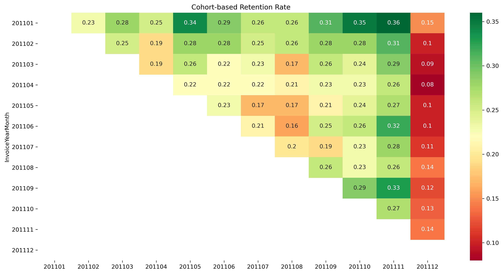
    


# PART B
## MARKET ATTRIBUTION MODELLING
In a typical _‘from think to buy’_ customer journey, a customer goes through multiple touch points before zeroing in on the final product to buy. This is even more prominent in the case of e-commerce sales. It is relatively easier to track which are the different touch points the customer has encountered before making the final purchase.

As marketing moves more and more towards the consumer driven side of things, identifying the right channels to target customers has become critical for companies. This helps companies optimise their marketing spend and target the right customers in the right places.

More often than not, companies usually invest in the last channel which customers encounter before making the final purchase. However, this may not always be the right approach. There are multiple channels preceding that channel which eventually drive the customer conversion. The underlying concept to study this behavior is known as **multi-channel attribution modeling.**

## 3. CHANNEL ATTRIBUTION
An attribution model is the rule, or set of rules, that determines how credit for sales and conversions is assigned to touchpoints in conversion paths. 

In this section i will use and compare 3 channel attribution models namely: First touch, Last touch and Markov chain.

1. **First Touch Attribution:** The First Interaction model assigns 100% credit to touchpoints that initiate conversion paths.

2. **Last Touch Attribution:** The Last Interaction model 100% credit to the final touchpoints (i.e., clicks) that immediately precede sales or conversions

3. **Markov Chain:** Markov Chain Model is a model that describes a sequence of events where the probability of each event depends only on the previous one. In the specific case of attribution modeling, the graph is the set of all customer paths, and the events are the visits to our website or our app, defined by the channel that brought the customer to it. As for the model's outcome, it is simply the conversion (1/0: there is/not a conversion at the end of the sequence).

#### Assumption
The dataset that does not contain information such as sales/marketing channels. However, for illustration purposes and to prove my knowledge of growth techniques such as **attribution modelling**, i created random sales channels and assume the conversion occurs due to one or some of these channels.


```python
channels = ['TV', 'Radio', 'Facebook', 'Google', 'Instagram']
conversion = [0,1]
tx_min_purchase['Conversion'] = tx_min_purchase.apply(lambda x: np.random.choice(conversion, p=[0.65, 0.35] ),axis=1)
```


```python

df = pd.merge(tx_uk[['InvoiceNo', 'CustomerID', 'InvoiceDate']], tx_min_purchase[['CustomerID','Conversion']], 
              on='CustomerID', how='inner')
df['AcqChannel'] = df.apply(lambda x: np.random.choice(channels, p=[0.08, 0.10, 0.2, 0.28, 0.34]),axis=1)

```


```python
df.head()
```


<div>
<style scoped>
    .dataframe tbody tr th:only-of-type {
        vertical-align: middle;
    }

    .dataframe tbody tr th {
        vertical-align: top;
    }

    .dataframe thead th {
        text-align: right;
    }
</style>
<table border="1" class="dataframe">
  <thead>
    <tr style="text-align: right;">
      <th></th>
      <th>InvoiceNo</th>
      <th>CustomerID</th>
      <th>InvoiceDate</th>
      <th>Conversion</th>
      <th>AcqChannel</th>
    </tr>
  </thead>
  <tbody>
    <tr>
      <th>0</th>
      <td>536365</td>
      <td>17850.0</td>
      <td>2010-12-01 08:26:00</td>
      <td>1</td>
      <td>Instagram</td>
    </tr>
    <tr>
      <th>1</th>
      <td>536365</td>
      <td>17850.0</td>
      <td>2010-12-01 08:26:00</td>
      <td>1</td>
      <td>Google</td>
    </tr>
    <tr>
      <th>2</th>
      <td>536365</td>
      <td>17850.0</td>
      <td>2010-12-01 08:26:00</td>
      <td>1</td>
      <td>Instagram</td>
    </tr>
    <tr>
      <th>3</th>
      <td>536365</td>
      <td>17850.0</td>
      <td>2010-12-01 08:26:00</td>
      <td>1</td>
      <td>Instagram</td>
    </tr>
    <tr>
      <th>4</th>
      <td>536365</td>
      <td>17850.0</td>
      <td>2010-12-01 08:26:00</td>
      <td>1</td>
      <td>Instagram</td>
    </tr>
  </tbody>
</table>
</div>


```python
df = df.sort_values(['CustomerID', 'InvoiceDate'],
                    ascending=[False, True])
df['visit_order'] = df.groupby('CustomerID').cumcount() + 1
df.head()
```


<div>
<style scoped>
    .dataframe tbody tr th:only-of-type {
        vertical-align: middle;
    }

    .dataframe tbody tr th {
        vertical-align: top;
    }

    .dataframe thead th {
        text-align: right;
    }
</style>
<table border="1" class="dataframe">
  <thead>
    <tr style="text-align: right;">
      <th></th>
      <th>InvoiceNo</th>
      <th>CustomerID</th>
      <th>InvoiceDate</th>
      <th>Conversion</th>
      <th>AcqChannel</th>
      <th>visit_order</th>
    </tr>
  </thead>
  <tbody>
    <tr>
      <th>286057</th>
      <td>554065</td>
      <td>18287.0</td>
      <td>2011-05-22 10:39:00</td>
      <td>0</td>
      <td>Instagram</td>
      <td>1</td>
    </tr>
    <tr>
      <th>286058</th>
      <td>554065</td>
      <td>18287.0</td>
      <td>2011-05-22 10:39:00</td>
      <td>0</td>
      <td>Instagram</td>
      <td>2</td>
    </tr>
    <tr>
      <th>286059</th>
      <td>554065</td>
      <td>18287.0</td>
      <td>2011-05-22 10:39:00</td>
      <td>0</td>
      <td>Instagram</td>
      <td>3</td>
    </tr>
    <tr>
      <th>286060</th>
      <td>554065</td>
      <td>18287.0</td>
      <td>2011-05-22 10:39:00</td>
      <td>0</td>
      <td>Google</td>
      <td>4</td>
    </tr>
    <tr>
      <th>286061</th>
      <td>554065</td>
      <td>18287.0</td>
      <td>2011-05-22 10:39:00</td>
      <td>0</td>
      <td>Instagram</td>
      <td>5</td>
    </tr>
  </tbody>
</table>
</div>


```python
df_paths = df.groupby('CustomerID')['AcqChannel'].aggregate(
    lambda x: x.unique().tolist()).reset_index()
    
df_paths.head()
```


<div>
<style scoped>
    .dataframe tbody tr th:only-of-type {
        vertical-align: middle;
    }

    .dataframe tbody tr th {
        vertical-align: top;
    }

    .dataframe thead th {
        text-align: right;
    }
</style>
<table border="1" class="dataframe">
  <thead>
    <tr style="text-align: right;">
      <th></th>
      <th>CustomerID</th>
      <th>AcqChannel</th>
    </tr>
  </thead>
  <tbody>
    <tr>
      <th>0</th>
      <td>12346.0</td>
      <td>[TV, Instagram]</td>
    </tr>
    <tr>
      <th>1</th>
      <td>12747.0</td>
      <td>[Google, Instagram, Radio, Facebook, TV]</td>
    </tr>
    <tr>
      <th>2</th>
      <td>12748.0</td>
      <td>[TV, Google, Instagram, Facebook, Radio]</td>
    </tr>
    <tr>
      <th>3</th>
      <td>12749.0</td>
      <td>[Google, Facebook, Radio, Instagram, TV]</td>
    </tr>
    <tr>
      <th>4</th>
      <td>12820.0</td>
      <td>[Instagram, Facebook, Google, Radio, TV]</td>
    </tr>
  </tbody>
</table>
</div>


```python
df_last_interaction = df.drop_duplicates('CustomerID', keep='last')[['CustomerID', 'Conversion']]

df_paths = pd.merge(df_paths, df_last_interaction, how='left', on='CustomerID')

```


```python
df_paths['path'] = np.where(df_paths['Conversion'] == 0,
                            ['Start, '] + df_paths['AcqChannel'].apply(', '.join) + [', Null'],
                            ['Start, '] + df_paths['AcqChannel'].apply(', '.join) + [', Conversion'])

df_paths['path'] = df_paths['path'].str.split(', ')
```


```python
df_paths = df_paths[['CustomerID', 'path']]
```


```python
df_paths.head()
```


<div>
<style scoped>
    .dataframe tbody tr th:only-of-type {
        vertical-align: middle;
    }

    .dataframe tbody tr th {
        vertical-align: top;
    }

    .dataframe thead th {
        text-align: right;
    }
</style>
<table border="1" class="dataframe">
  <thead>
    <tr style="text-align: right;">
      <th></th>
      <th>CustomerID</th>
      <th>path</th>
    </tr>
  </thead>
  <tbody>
    <tr>
      <th>0</th>
      <td>12346.0</td>
      <td>[Start, TV, Instagram, Null]</td>
    </tr>
    <tr>
      <th>1</th>
      <td>12747.0</td>
      <td>[Start, Google, Instagram, Radio, Facebook, TV...</td>
    </tr>
    <tr>
      <th>2</th>
      <td>12748.0</td>
      <td>[Start, TV, Google, Instagram, Facebook, Radio...</td>
    </tr>
    <tr>
      <th>3</th>
      <td>12749.0</td>
      <td>[Start, Google, Facebook, Radio, Instagram, TV...</td>
    </tr>
    <tr>
      <th>4</th>
      <td>12820.0</td>
      <td>[Start, Instagram, Facebook, Google, Radio, TV...</td>
    </tr>
  </tbody>
</table>
</div>


## 3.1 Markov Chains

The algorithm for Markov Chains can be summarized in 2 steps:
- Calculate transition probabilities between all states in our state-space
- Calculate removal effects (for more info on removal effects, see part 1)

I’ll start by defining a list of all user journeys, the number of total conversion and the base level conversion rate.


```python
#_________function to calculate transition states

list_of_paths = df_paths['path']
total_conversions = sum(path.count('Conversion') for path in df_paths['path'].tolist())
base_conversion_rate = total_conversions / len(list_of_paths)

```


#### Function that identifies all potential state transitions and outputs a dictionary containing these. 
I’ll use this as an input when calculating transition probabilities


```python
def transition_states(list_of_paths):
    list_of_unique_channels = set(x for element in list_of_paths for x in element)
    transition_states = {x + '>' + y: 0 for x in list_of_unique_channels for y in list_of_unique_channels}

    for possible_state in list_of_unique_channels:
        if possible_state not in ['Conversion', 'Null']:
            for user_path in list_of_paths:
                if possible_state in user_path:
                    indices = [i for i, s in enumerate(user_path) if possible_state == s]
                    for col in indices:
                        transition_states[user_path[col] + '>' + user_path[col + 1]] += 1

    return transition_states


trans_states = transition_states(list_of_paths)
```

#### Function to calculate all transition probabilities


```python
def transition_prob(trans_dict):
    list_of_unique_channels = set(x for element in list_of_paths for x in element)
    trans_prob = defaultdict(dict)
    for state in list_of_unique_channels:
        if state not in ['Conversion', 'Null']:
            counter = 0
            index = [i for i, s in enumerate(trans_dict) if state + '>' in s]
            for col in index:
                if trans_dict[list(trans_dict)[col]] > 0:
                    counter += trans_dict[list(trans_dict)[col]]
            for col in index:
                if trans_dict[list(trans_dict)[col]] > 0:
                    state_prob = float((trans_dict[list(trans_dict)[col]])) / float(counter)
                    trans_prob[list(trans_dict)[col]] = state_prob

    return trans_prob


trans_prob = transition_prob(trans_states)
```

#### Converting Transition Probabilities to DataFrame

To do this we’ll make use of linear algebra and matrix manipulations, therefore let’s turn our above transition probabilities dictionary into a data frame (matrix).


```python
#_______ transition matrix__________

def transition_matrix(list_of_paths, transition_probabilities):
    trans_matrix = pd.DataFrame()
    list_of_unique_channels = set(x for element in list_of_paths for x in element)

    for channel in list_of_unique_channels:
        trans_matrix[channel] = 0.00
        trans_matrix.loc[channel] = 0.00
        trans_matrix.loc[channel][channel] = 1.0 if channel in ['Conversion', 'Null'] else 0.0

    for key, value in transition_probabilities.items():
        origin, destination = key.split('>')
        trans_matrix.at[origin, destination] = value

    return trans_matrix

```


```python
trans_matrix = transition_matrix(list_of_paths, trans_prob)
trans_matrix = trans_matrix.round(2)
#trans_matrix.to_excel('transition_matrix.xlsx')
```


```python
trans_matrix
```


<div>
<style scoped>
    .dataframe tbody tr th:only-of-type {
        vertical-align: middle;
    }

    .dataframe tbody tr th {
        vertical-align: top;
    }

    .dataframe thead th {
        text-align: right;
    }
</style>
<table border="1" class="dataframe">
  <thead>
    <tr style="text-align: right;">
      <th></th>
      <th>Start</th>
      <th>Null</th>
      <th>Conversion</th>
      <th>Radio</th>
      <th>Facebook</th>
      <th>Google</th>
      <th>Instagram</th>
      <th>TV</th>
    </tr>
  </thead>
  <tbody>
    <tr>
      <th>Start</th>
      <td>0.0</td>
      <td>0.00</td>
      <td>0.00</td>
      <td>0.10</td>
      <td>0.20</td>
      <td>0.29</td>
      <td>0.34</td>
      <td>0.08</td>
    </tr>
    <tr>
      <th>Null</th>
      <td>0.0</td>
      <td>1.00</td>
      <td>0.00</td>
      <td>0.00</td>
      <td>0.00</td>
      <td>0.00</td>
      <td>0.00</td>
      <td>0.00</td>
    </tr>
    <tr>
      <th>Conversion</th>
      <td>0.0</td>
      <td>0.00</td>
      <td>1.00</td>
      <td>0.00</td>
      <td>0.00</td>
      <td>0.00</td>
      <td>0.00</td>
      <td>0.00</td>
    </tr>
    <tr>
      <th>Radio</th>
      <td>0.0</td>
      <td>0.22</td>
      <td>0.12</td>
      <td>0.00</td>
      <td>0.16</td>
      <td>0.14</td>
      <td>0.13</td>
      <td>0.22</td>
    </tr>
    <tr>
      <th>Facebook</th>
      <td>0.0</td>
      <td>0.10</td>
      <td>0.07</td>
      <td>0.21</td>
      <td>0.00</td>
      <td>0.20</td>
      <td>0.21</td>
      <td>0.21</td>
    </tr>
    <tr>
      <th>Google</th>
      <td>0.0</td>
      <td>0.07</td>
      <td>0.03</td>
      <td>0.21</td>
      <td>0.25</td>
      <td>0.00</td>
      <td>0.24</td>
      <td>0.19</td>
    </tr>
    <tr>
      <th>Instagram</th>
      <td>0.0</td>
      <td>0.06</td>
      <td>0.04</td>
      <td>0.21</td>
      <td>0.24</td>
      <td>0.26</td>
      <td>0.00</td>
      <td>0.20</td>
    </tr>
    <tr>
      <th>TV</th>
      <td>0.0</td>
      <td>0.26</td>
      <td>0.15</td>
      <td>0.19</td>
      <td>0.15</td>
      <td>0.13</td>
      <td>0.11</td>
      <td>0.00</td>
    </tr>
  </tbody>
</table>
</div>


### 3.1.1 Marketing Channels Interaction Probabilities

The transition probabilities heatmap below visualizes how our marketing channels interacts with each other. For instance, the probability of conversion (that is, purchasing a product) after engaging with TV is 7%, the probability of a customer engaging with Facebook after watching TV is 15% and so on.

Using historical context and the heat map above we not only gain insights into how each marketing channel is driving users towards our conversion event, but we also gain critical information around how our marketing channels are interacting with each other. Given today’s typical multi-touch conversion journeys this information can prove to be extremely valuable and allows us to optimize our multi-channel customer journeys for conversion.


```python
tr = trans_matrix.copy()
tr = tr.reindex(['TV','Facebook', 'Instagram', 'Radio','Google', 'Start'], axis=0)
#tr.drop('Start', axis=1, inplace=True)
tr = tr.reindex(['Conversion','Facebook', 'Instagram', 'Radio','Google','Null'], axis=1)
plt.figure(figsize=[16,8], dpi = 300)
sns.heatmap(tr, annot = True, cmap="Blues", cbar = False, annot_kws={"size": 9})
plt.title('Transition Matrix Heatmap')
plt.xlabel('Channel to')
plt.ylabel('Channel from')
```


    Text(514.1666666666667, 0.5, 'Channel from')


    
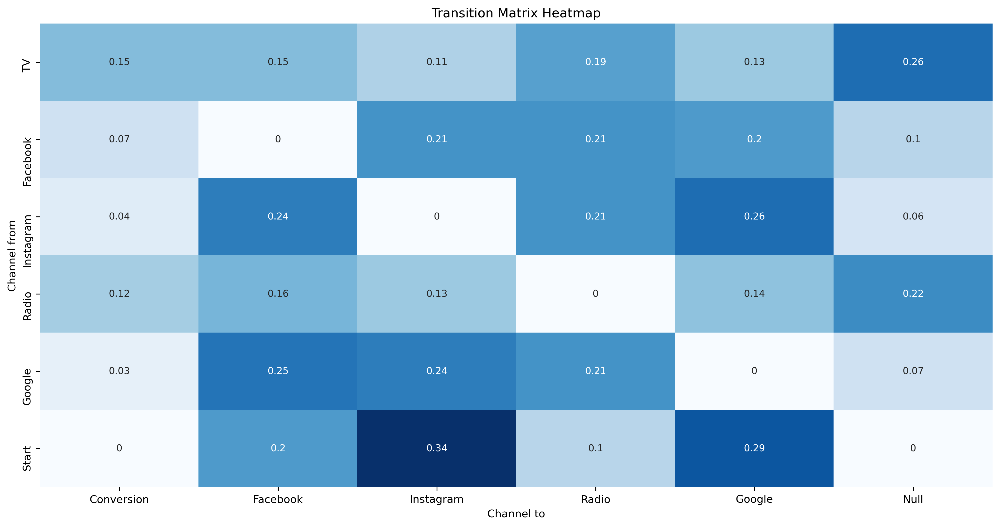
    


### 3.1.2 Removal Effects Function
If we were to figure out what is the contribution of a channel in our customer’s journey from start to end conversion, we will use the principle of removal effect. **Removal effect principle** says that if we want to find the contribution of each channel in the customer journey, we can do so by removing each channel and see how many conversions are happening without that channel being in place.


```python
def removal_effects(df, conversion_rate):
    removal_effects_dict = {}
    channels = [channel for channel in df.columns if channel not in ['Start',
                                                                     'Null',
                                                                     'Conversion']]
    for channel in channels:
        removal_df = df.drop(channel, axis=1).drop(channel, axis=0)
        for column in removal_df.columns:
            row_sum = np.sum(list(removal_df.loc[column]))
            null_pct = float(1) - row_sum
            if null_pct != 0:
                removal_df.loc[column]['Null'] = null_pct
            removal_df.loc['Null']['Null'] = 1.0

        removal_to_conv = removal_df[
            ['Null', 'Conversion']].drop(['Null', 'Conversion'], axis=0)
        removal_to_non_conv = removal_df.drop(
            ['Null', 'Conversion'], axis=1).drop(['Null', 'Conversion'], axis=0)

        removal_inv_diff = np.linalg.inv(
            np.identity(
                len(removal_to_non_conv.columns)) - np.asarray(removal_to_non_conv))
        removal_dot_prod = np.dot(removal_inv_diff, np.asarray(removal_to_conv))
        removal_cvr = pd.DataFrame(removal_dot_prod,
                                   index=removal_to_conv.index)[[1]].loc['Start'].values[0]
        removal_effect = 1 - removal_cvr / conversion_rate
        removal_effects_dict[channel] = removal_effect

    return removal_effects_dict

```


```python
removal_effects_dict = removal_effects(trans_matrix, base_conversion_rate)

remov = pd.DataFrame.from_dict(removal_effects_dict, orient = 'index')
remov.reset_index(inplace=True)
remov.columns = ['channel','removal_effects']
```

#### Total number of conversion attributed to each channel by the Markov Chain algorithm:


```python
def markov_chain_allocations(removal_effects, total_conversions):
    re_sum = np.sum(list(removal_effects.values()))

    return {k: (v / re_sum) * total_conversions for k, v in removal_effects.items()}


attributions = markov_chain_allocations(removal_effects_dict, total_conversions)
```


```python
attrib = pd.DataFrame.from_dict(attributions, orient='index')
attrib.reset_index(inplace = True)
attrib.columns = ['channel','attributed_conversions']
attrib['attributed_conversions'] = attrib['attributed_conversions'].astype(int)
```


```python
full_conversion = remov.merge(attrib, on = 'channel')
full_conversion['removal_effects'] = full_conversion['removal_effects'].round(1)
full_conversion = full_conversion.sort_values(by='attributed_conversions', ascending=False)
full_conversion
```


<div>
<style scoped>
    .dataframe tbody tr th:only-of-type {
        vertical-align: middle;
    }

    .dataframe tbody tr th {
        vertical-align: top;
    }

    .dataframe thead th {
        text-align: right;
    }
</style>
<table border="1" class="dataframe">
  <thead>
    <tr style="text-align: right;">
      <th></th>
      <th>channel</th>
      <th>removal_effects</th>
      <th>attributed_conversions</th>
    </tr>
  </thead>
  <tbody>
    <tr>
      <th>3</th>
      <td>Instagram</td>
      <td>0.6</td>
      <td>302</td>
    </tr>
    <tr>
      <th>1</th>
      <td>Facebook</td>
      <td>0.6</td>
      <td>289</td>
    </tr>
    <tr>
      <th>2</th>
      <td>Google</td>
      <td>0.6</td>
      <td>284</td>
    </tr>
    <tr>
      <th>4</th>
      <td>TV</td>
      <td>0.6</td>
      <td>279</td>
    </tr>
    <tr>
      <th>0</th>
      <td>Radio</td>
      <td>0.6</td>
      <td>275</td>
    </tr>
  </tbody>
</table>
</div>


```python
plt.figure(figsize=(15,10), dpi=300)
#sns.set_style("whitegrid")
sns.barplot("channel", y="attributed_conversions", data=full_conversion)
plt.xlabel('Marketing Channel')
plt.ylabel('Number of conversions')
plt.title('Total Number of Conversions to each Channel by Markov Chain')
#plt.savefig('Attribution.eps', format = 'eps', dpi = 1000)
```


    Text(0.5, 1.0, 'Total Number of Conversions to each Channel by Markov Chain')


    
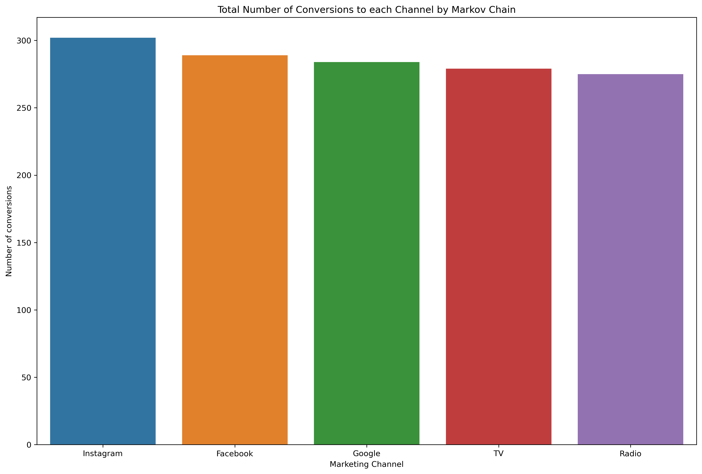
    


## 3.2 First Touch Attribution
The revenue generated by the purchase is attributed to the first marketing channel the user engaged with, on the journey towards the purchase.


```python
########################################################
#___________ FIRST INTERACTION
########################################################

df_first = df.drop_duplicates('CustomerID', keep='first')[['CustomerID', 'AcqChannel','Conversion']]
df_first = pd.DataFrame(df_first.groupby('AcqChannel')['Conversion'].sum())
df_first.reset_index(inplace= True)
df_first = df_first.rename(columns = {'AcqChannel': 'channel', 'Conversion':'first'})

df_first
```


<div>
<style scoped>
    .dataframe tbody tr th:only-of-type {
        vertical-align: middle;
    }

    .dataframe tbody tr th {
        vertical-align: top;
    }

    .dataframe thead th {
        text-align: right;
    }
</style>
<table border="1" class="dataframe">
  <thead>
    <tr style="text-align: right;">
      <th></th>
      <th>channel</th>
      <th>first</th>
    </tr>
  </thead>
  <tbody>
    <tr>
      <th>0</th>
      <td>Facebook</td>
      <td>266</td>
    </tr>
    <tr>
      <th>1</th>
      <td>Google</td>
      <td>430</td>
    </tr>
    <tr>
      <th>2</th>
      <td>Instagram</td>
      <td>473</td>
    </tr>
    <tr>
      <th>3</th>
      <td>Radio</td>
      <td>144</td>
    </tr>
    <tr>
      <th>4</th>
      <td>TV</td>
      <td>117</td>
    </tr>
  </tbody>
</table>
</div>


## 3.3 Last Touch Attribution

As the name suggests, Last Touch is the attribution approach where any revenue generated is attributed to the marketing channel that a user last engaged with.
While this approach has its advantage in its simplicity, we run the risk of oversimplifying our attribution, as the last touch isn’t necessarily the marketing activity that generates the purchase.


```python
########################################################
#___________ LAST INTERACTION
########################################################

df_last = df.drop_duplicates('CustomerID', keep='last')[['CustomerID', 'AcqChannel','Conversion']]
df_last = pd.DataFrame(df_last.groupby('AcqChannel')['Conversion'].sum())
df_last.reset_index(inplace = True)
df_last = df_last.rename(columns = {'AcqChannel': 'channel', 'Conversion':'last'})
df_last
```


<div>
<style scoped>
    .dataframe tbody tr th:only-of-type {
        vertical-align: middle;
    }

    .dataframe tbody tr th {
        vertical-align: top;
    }

    .dataframe thead th {
        text-align: right;
    }
</style>
<table border="1" class="dataframe">
  <thead>
    <tr style="text-align: right;">
      <th></th>
      <th>channel</th>
      <th>last</th>
    </tr>
  </thead>
  <tbody>
    <tr>
      <th>0</th>
      <td>Facebook</td>
      <td>274</td>
    </tr>
    <tr>
      <th>1</th>
      <td>Google</td>
      <td>381</td>
    </tr>
    <tr>
      <th>2</th>
      <td>Instagram</td>
      <td>511</td>
    </tr>
    <tr>
      <th>3</th>
      <td>Radio</td>
      <td>151</td>
    </tr>
    <tr>
      <th>4</th>
      <td>TV</td>
      <td>113</td>
    </tr>
  </tbody>
</table>
</div>


## 3.4 Comparing First, Last and Markov Touch Attribution


```python
full_conversion = full_conversion.rename(columns = {'attributed_conversions': 'markov'})
full_conversion = full_conversion.drop(['removal_effects'], axis=1)

full_conversion = pd.merge(full_conversion, df_first, on ='channel', how = 'inner')
full_conversion = pd.merge(full_conversion, df_last, on ='channel', how = 'inner')

full_conversion.reset_index(inplace = True, drop = True)
full_conversion
```


<div>
<style scoped>
    .dataframe tbody tr th:only-of-type {
        vertical-align: middle;
    }

    .dataframe tbody tr th {
        vertical-align: top;
    }

    .dataframe thead th {
        text-align: right;
    }
</style>
<table border="1" class="dataframe">
  <thead>
    <tr style="text-align: right;">
      <th></th>
      <th>channel</th>
      <th>markov</th>
      <th>first</th>
      <th>last</th>
    </tr>
  </thead>
  <tbody>
    <tr>
      <th>0</th>
      <td>Instagram</td>
      <td>302</td>
      <td>473</td>
      <td>511</td>
    </tr>
    <tr>
      <th>1</th>
      <td>Facebook</td>
      <td>289</td>
      <td>266</td>
      <td>274</td>
    </tr>
    <tr>
      <th>2</th>
      <td>Google</td>
      <td>284</td>
      <td>430</td>
      <td>381</td>
    </tr>
    <tr>
      <th>3</th>
      <td>TV</td>
      <td>279</td>
      <td>117</td>
      <td>113</td>
    </tr>
    <tr>
      <th>4</th>
      <td>Radio</td>
      <td>275</td>
      <td>144</td>
      <td>151</td>
    </tr>
  </tbody>
</table>
</div>


```python
full_conv2 = pd.melt(full_conversion, id_vars=['channel'])
full_conv2.columns = ['channel', 'model', 'num_of_conversions']
full_conv2
```


<div>
<style scoped>
    .dataframe tbody tr th:only-of-type {
        vertical-align: middle;
    }

    .dataframe tbody tr th {
        vertical-align: top;
    }

    .dataframe thead th {
        text-align: right;
    }
</style>
<table border="1" class="dataframe">
  <thead>
    <tr style="text-align: right;">
      <th></th>
      <th>channel</th>
      <th>model</th>
      <th>num_of_conversions</th>
    </tr>
  </thead>
  <tbody>
    <tr>
      <th>0</th>
      <td>Instagram</td>
      <td>markov</td>
      <td>302</td>
    </tr>
    <tr>
      <th>1</th>
      <td>Facebook</td>
      <td>markov</td>
      <td>289</td>
    </tr>
    <tr>
      <th>2</th>
      <td>Google</td>
      <td>markov</td>
      <td>284</td>
    </tr>
    <tr>
      <th>3</th>
      <td>TV</td>
      <td>markov</td>
      <td>279</td>
    </tr>
    <tr>
      <th>4</th>
      <td>Radio</td>
      <td>markov</td>
      <td>275</td>
    </tr>
    <tr>
      <th>5</th>
      <td>Instagram</td>
      <td>first</td>
      <td>473</td>
    </tr>
    <tr>
      <th>6</th>
      <td>Facebook</td>
      <td>first</td>
      <td>266</td>
    </tr>
    <tr>
      <th>7</th>
      <td>Google</td>
      <td>first</td>
      <td>430</td>
    </tr>
    <tr>
      <th>8</th>
      <td>TV</td>
      <td>first</td>
      <td>117</td>
    </tr>
    <tr>
      <th>9</th>
      <td>Radio</td>
      <td>first</td>
      <td>144</td>
    </tr>
    <tr>
      <th>10</th>
      <td>Instagram</td>
      <td>last</td>
      <td>511</td>
    </tr>
    <tr>
      <th>11</th>
      <td>Facebook</td>
      <td>last</td>
      <td>274</td>
    </tr>
    <tr>
      <th>12</th>
      <td>Google</td>
      <td>last</td>
      <td>381</td>
    </tr>
    <tr>
      <th>13</th>
      <td>TV</td>
      <td>last</td>
      <td>113</td>
    </tr>
    <tr>
      <th>14</th>
      <td>Radio</td>
      <td>last</td>
      <td>151</td>
    </tr>
  </tbody>
</table>
</div>


```python
plt.figure(figsize=(15,10), dpi=300)
sns.barplot(x="channel", y="num_of_conversions", hue="model", data=full_conv2)
#sns.catplot(x="channel", y="value", hue="variable", kind="bar", data=full_conv2)
plt.title('Marketing Attribution to Marketing Channel by Model')
plt.xlabel('Marketing Channel')
plt.ylabel('Number of Conversions')
```


    Text(0, 0.5, 'Number of Conversions')


    
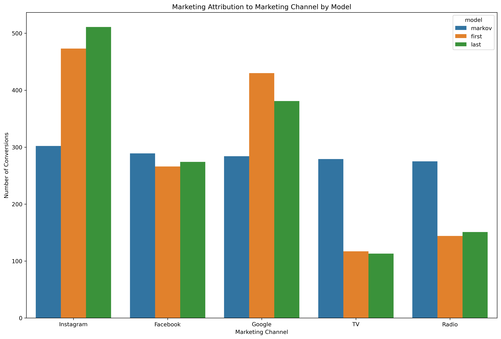
    


```python
sns.catplot(x="channel", y="num_of_conversions", col="model", data=full_conv2, kind="bar", height=7, aspect=.7)
```


    <seaborn.axisgrid.FacetGrid at 0x7fd3c93c86a0>


    
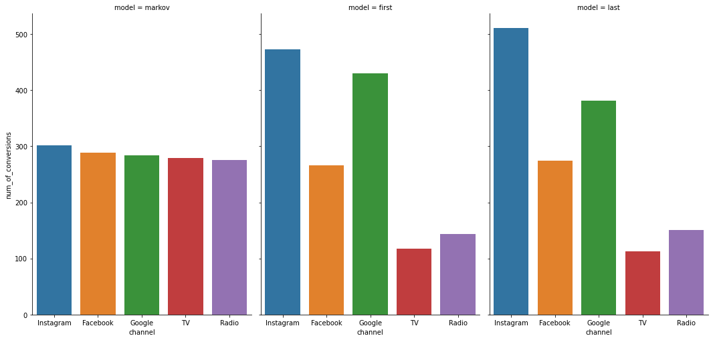
    


# PART C
# 4. CUSTOMER SEGMENTATION

#### But first off, why we do segmentation?

Because we can’t treat every customer the same way with the same content, same channel, same importance. They will find another option which understands them better.

Customers who use our platform have different needs and they have their own different profile. We should adapt our actions depending on that. We can do different segmentations according to what we are trying to achieve. If we want to increase retention rate, we can do a segmentation based on churn probability and take actions. But there are very common and useful segmentation methods as well. 

In this section, i will implement one of them to the data: RFM which means Recency, Frequency and Montary value segmentation.

We can have customer segments such as these:

1. **Low Value:** Customers who are less active than others, not very frequent buyer/visitor and generates very low - zero - maybe negative revenue.

2. **Mid Value:** In the middle of everything. Often using our platform (but not as much as our High Values), fairly frequent and generates moderate revenue.

3. **High Value:** The group we don’t want to lose. High Revenue, Frequency and low Inactivity.

We need to calculate Recency, Frequency and Monetary Value (we will call it Revenue from now on) and apply unsupervised machine learning to identify different groups (clusters) for each.

In summary, we would prefer customers with:

- Low recency (that is purchase our product recently) to high recency (purhcase our products many weeks ago).
- High Frequency (purchases frequently)
- Highy Monetary value (Revenue)


```python
from __future__ import division
from datetime import datetime, timedelta
```


```python
tx_uk.tail()
```


<div>
<style scoped>
    .dataframe tbody tr th:only-of-type {
        vertical-align: middle;
    }

    .dataframe tbody tr th {
        vertical-align: top;
    }

    .dataframe thead th {
        text-align: right;
    }
</style>
<table border="1" class="dataframe">
  <thead>
    <tr style="text-align: right;">
      <th></th>
      <th>InvoiceNo</th>
      <th>StockCode</th>
      <th>Description</th>
      <th>Quantity</th>
      <th>InvoiceDate</th>
      <th>UnitPrice</th>
      <th>CustomerID</th>
      <th>Country</th>
      <th>InvoiceYearMonth</th>
      <th>Revenue</th>
      <th>MinPurchaseDate</th>
      <th>MinPurchaseYearMonth</th>
      <th>UserType</th>
    </tr>
  </thead>
  <tbody>
    <tr>
      <th>361873</th>
      <td>581416</td>
      <td>22809</td>
      <td>SET OF 6 T-LIGHTS SANTA</td>
      <td>1</td>
      <td>2011-12-08 14:58:00</td>
      <td>2.95</td>
      <td>14569.0</td>
      <td>United Kingdom</td>
      <td>201112</td>
      <td>2.95</td>
      <td>2011-12-08 14:58:00</td>
      <td>201112</td>
      <td>First-time</td>
    </tr>
    <tr>
      <th>361874</th>
      <td>581416</td>
      <td>22807</td>
      <td>SET OF 6 T-LIGHTS TOADSTOOLS</td>
      <td>2</td>
      <td>2011-12-08 14:58:00</td>
      <td>1.25</td>
      <td>14569.0</td>
      <td>United Kingdom</td>
      <td>201112</td>
      <td>2.50</td>
      <td>2011-12-08 14:58:00</td>
      <td>201112</td>
      <td>First-time</td>
    </tr>
    <tr>
      <th>361875</th>
      <td>581416</td>
      <td>72349B</td>
      <td>SET/6 PURPLE BUTTERFLY T-LIGHTS</td>
      <td>1</td>
      <td>2011-12-08 14:58:00</td>
      <td>2.10</td>
      <td>14569.0</td>
      <td>United Kingdom</td>
      <td>201112</td>
      <td>2.10</td>
      <td>2011-12-08 14:58:00</td>
      <td>201112</td>
      <td>First-time</td>
    </tr>
    <tr>
      <th>361876</th>
      <td>581416</td>
      <td>22809</td>
      <td>SET OF 6 T-LIGHTS SANTA</td>
      <td>2</td>
      <td>2011-12-08 14:58:00</td>
      <td>2.95</td>
      <td>14569.0</td>
      <td>United Kingdom</td>
      <td>201112</td>
      <td>5.90</td>
      <td>2011-12-08 14:58:00</td>
      <td>201112</td>
      <td>First-time</td>
    </tr>
    <tr>
      <th>361877</th>
      <td>581416</td>
      <td>23487</td>
      <td>SWEET HEART CAKE CARRIER</td>
      <td>1</td>
      <td>2011-12-08 14:58:00</td>
      <td>9.95</td>
      <td>14569.0</td>
      <td>United Kingdom</td>
      <td>201112</td>
      <td>9.95</td>
      <td>2011-12-08 14:58:00</td>
      <td>201112</td>
      <td>First-time</td>
    </tr>
  </tbody>
</table>
</div>


```python
tx_user = pd.DataFrame(tx_uk['CustomerID'].unique())
tx_user.columns = ['CustomerID']
```

## 4.1 Recency


```python
tx_max_purchase = tx_uk.groupby('CustomerID').InvoiceDate.max().reset_index()
```


```python
tx_max_purchase.columns = ['CustomerID','MaxPurchaseDate']
```


```python
tx_max_purchase['Recency'] = (tx_max_purchase['MaxPurchaseDate'].max() - tx_max_purchase['MaxPurchaseDate']).dt.days
```


```python
tx_user = pd.merge(tx_user, tx_max_purchase[['CustomerID','Recency']], on='CustomerID')
```


```python
tx_user.head()
```


<div>
<style scoped>
    .dataframe tbody tr th:only-of-type {
        vertical-align: middle;
    }

    .dataframe tbody tr th {
        vertical-align: top;
    }

    .dataframe thead th {
        text-align: right;
    }
</style>
<table border="1" class="dataframe">
  <thead>
    <tr style="text-align: right;">
      <th></th>
      <th>CustomerID</th>
      <th>Recency</th>
    </tr>
  </thead>
  <tbody>
    <tr>
      <th>0</th>
      <td>17850.0</td>
      <td>301</td>
    </tr>
    <tr>
      <th>1</th>
      <td>13047.0</td>
      <td>31</td>
    </tr>
    <tr>
      <th>2</th>
      <td>13748.0</td>
      <td>95</td>
    </tr>
    <tr>
      <th>3</th>
      <td>15100.0</td>
      <td>329</td>
    </tr>
    <tr>
      <th>4</th>
      <td>15291.0</td>
      <td>25</td>
    </tr>
  </tbody>
</table>
</div>


```python
tx_user.Recency.describe()
```


    count    3950.000000
    mean       90.778481
    std       100.230349
    min         0.000000
    25%        16.000000
    50%        49.000000
    75%       142.000000
    max       373.000000
    Name: Recency, dtype: float64


```python
#tx_user.plot(y='Recency', kind='hist', figsize=(16,5), legend=False)
plt.figure(figsize=(16,5), dpi=300)
tx_user['Recency'].plot.hist()
plt.title('Histogram of Recency')
plt.xlabel('Recency')
```


    Text(0.5, 0, 'Recency')


    
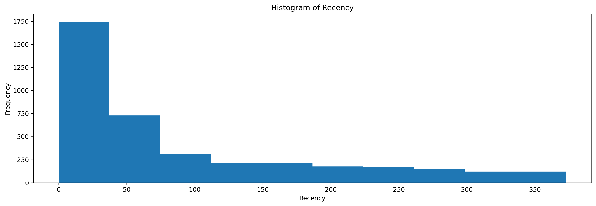
    


```python

sse={}
tx_recency = tx_user[['Recency']]
for k in range(1, 10):
    kmeans = KMeans(n_clusters=k, max_iter=1000).fit(tx_recency)
    tx_recency["clusters"] = kmeans.labels_
    sse[k] = kmeans.inertia_ 
    

```


```python
plt.figure(figsize=(16,5), dpi=300)
plt.plot(list(sse.keys()), list(sse.values()))
plt.xlabel("Number of cluster")
plt.title('Number of clusters for Recency and SSE')
plt.show()
```


    
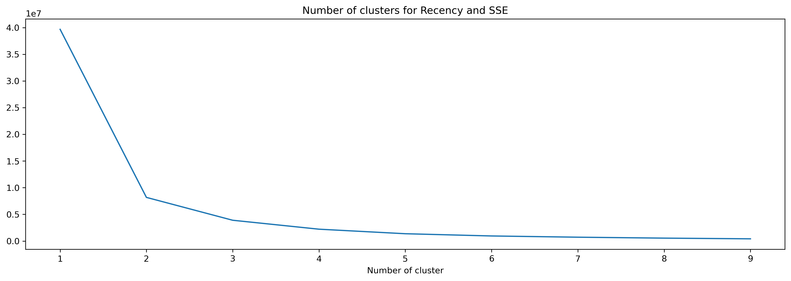
    


```python
kmeans = KMeans(n_clusters=3)
kmeans.fit(tx_user[['Recency']])
tx_user['RecencyCluster'] = kmeans.predict(tx_user[['Recency']])

```


```python
tx_user.groupby('RecencyCluster')['Recency'].describe()
```


<div>
<style scoped>
    .dataframe tbody tr th:only-of-type {
        vertical-align: middle;
    }

    .dataframe tbody tr th {
        vertical-align: top;
    }

    .dataframe thead th {
        text-align: right;
    }
</style>
<table border="1" class="dataframe">
  <thead>
    <tr style="text-align: right;">
      <th></th>
      <th>count</th>
      <th>mean</th>
      <th>std</th>
      <th>min</th>
      <th>25%</th>
      <th>50%</th>
      <th>75%</th>
      <th>max</th>
    </tr>
    <tr>
      <th>RecencyCluster</th>
      <th></th>
      <th></th>
      <th></th>
      <th></th>
      <th></th>
      <th></th>
      <th></th>
      <th></th>
    </tr>
  </thead>
  <tbody>
    <tr>
      <th>0</th>
      <td>564.0</td>
      <td>293.684397</td>
      <td>45.612310</td>
      <td>224.0</td>
      <td>255.0</td>
      <td>286.5</td>
      <td>326.75</td>
      <td>373.0</td>
    </tr>
    <tr>
      <th>1</th>
      <td>2651.0</td>
      <td>30.307808</td>
      <td>24.994104</td>
      <td>0.0</td>
      <td>9.0</td>
      <td>24.0</td>
      <td>49.00</td>
      <td>91.0</td>
    </tr>
    <tr>
      <th>2</th>
      <td>735.0</td>
      <td>153.185034</td>
      <td>38.155512</td>
      <td>92.0</td>
      <td>119.0</td>
      <td>153.0</td>
      <td>185.00</td>
      <td>222.0</td>
    </tr>
  </tbody>
</table>
</div>


#### Function to rearrange clusters


```python
def order_cluster(cluster_field_name, target_field_name,df,ascending):
    new_cluster_field_name = 'new_' + cluster_field_name
    df_new = df.groupby(cluster_field_name)[target_field_name].mean().reset_index()
    df_new = df_new.sort_values(by=target_field_name,ascending=ascending).reset_index(drop=True)
    df_new['index'] = df_new.index
    df_final = pd.merge(df,df_new[[cluster_field_name,'index']], on=cluster_field_name)
    df_final = df_final.drop([cluster_field_name],axis=1)
    df_final = df_final.rename(columns={"index":cluster_field_name})
    return df_final
```


```python
tx_user = order_cluster('RecencyCluster', 'Recency',tx_user,False)
```

## 4.2 Frequency


```python
tx_frequency = tx_uk.groupby('CustomerID').InvoiceDate.nunique().reset_index()
```


```python
tx_frequency.columns = ['CustomerID','Frequency']
```


```python
tx_frequency.head()
```


<div>
<style scoped>
    .dataframe tbody tr th:only-of-type {
        vertical-align: middle;
    }

    .dataframe tbody tr th {
        vertical-align: top;
    }

    .dataframe thead th {
        text-align: right;
    }
</style>
<table border="1" class="dataframe">
  <thead>
    <tr style="text-align: right;">
      <th></th>
      <th>CustomerID</th>
      <th>Frequency</th>
    </tr>
  </thead>
  <tbody>
    <tr>
      <th>0</th>
      <td>12346.0</td>
      <td>2</td>
    </tr>
    <tr>
      <th>1</th>
      <td>12747.0</td>
      <td>11</td>
    </tr>
    <tr>
      <th>2</th>
      <td>12748.0</td>
      <td>225</td>
    </tr>
    <tr>
      <th>3</th>
      <td>12749.0</td>
      <td>8</td>
    </tr>
    <tr>
      <th>4</th>
      <td>12820.0</td>
      <td>4</td>
    </tr>
  </tbody>
</table>
</div>


```python
tx_user = pd.merge(tx_user, tx_frequency, on='CustomerID')
```


```python
tx_user.head()
```


<div>
<style scoped>
    .dataframe tbody tr th:only-of-type {
        vertical-align: middle;
    }

    .dataframe tbody tr th {
        vertical-align: top;
    }

    .dataframe thead th {
        text-align: right;
    }
</style>
<table border="1" class="dataframe">
  <thead>
    <tr style="text-align: right;">
      <th></th>
      <th>CustomerID</th>
      <th>Recency</th>
      <th>RecencyCluster</th>
      <th>Frequency</th>
    </tr>
  </thead>
  <tbody>
    <tr>
      <th>0</th>
      <td>17850.0</td>
      <td>301</td>
      <td>0</td>
      <td>34</td>
    </tr>
    <tr>
      <th>1</th>
      <td>15100.0</td>
      <td>329</td>
      <td>0</td>
      <td>6</td>
    </tr>
    <tr>
      <th>2</th>
      <td>18074.0</td>
      <td>373</td>
      <td>0</td>
      <td>1</td>
    </tr>
    <tr>
      <th>3</th>
      <td>16250.0</td>
      <td>260</td>
      <td>0</td>
      <td>2</td>
    </tr>
    <tr>
      <th>4</th>
      <td>13747.0</td>
      <td>373</td>
      <td>0</td>
      <td>1</td>
    </tr>
  </tbody>
</table>
</div>


```python
tx_user.Frequency.describe()
```


    count    3950.000000
    mean        4.989367
    std         8.614673
    min         1.000000
    25%         1.000000
    50%         3.000000
    75%         5.000000
    max       225.000000
    Name: Frequency, dtype: float64


```python
#tx_user.plot(y='Frequency', kind='hist', figsize=(16,5), legend=False)
plt.figure(figsize=(16,5), dpi=300)
tx_user['Frequency'].plot.hist()
plt.title('Histogram of the Number of Transactions by Customers')
plt.xlabel('Frequency: Number of transactions')
```


    Text(0.5, 0, 'Frequency: Number of transactions')


    
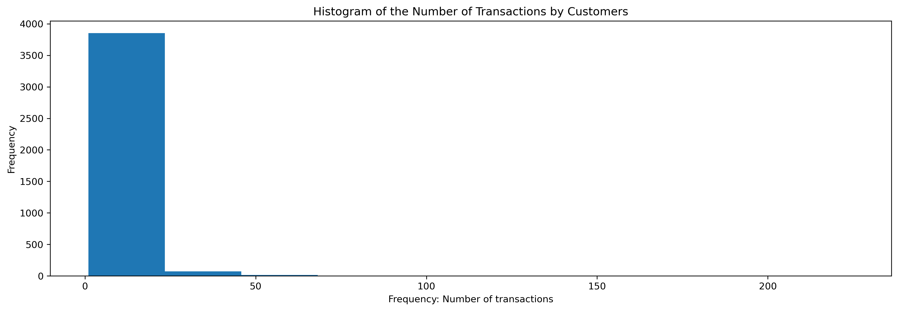
    


```python
sse={}
tx_frequency = tx_user[['Frequency']]

for k in range(1, 10):
    kmeans = KMeans(n_clusters=k, max_iter=1000).fit(tx_frequency)
    tx_frequency["clusters"] = kmeans.labels_
    sse[k] = kmeans.inertia_ 
```


```python
plt.figure(figsize=(16,5), dpi=300)
plt.plot(list(sse.keys()), list(sse.values()))
plt.xlabel("Number of clusters for Frequency")
```


    Text(0.5, 0, 'Number of clusters for Frequency')


    
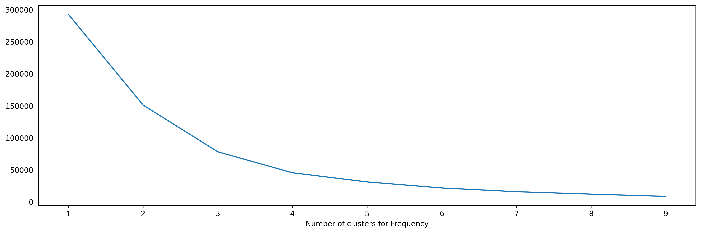
    


```python
kmeans = KMeans(n_clusters=3)
kmeans.fit(tx_user[['Frequency']])
tx_user['FrequencyCluster'] = kmeans.predict(tx_user[['Frequency']])


```


```python
tx_user.groupby('FrequencyCluster')['Frequency'].describe()
```


<div>
<style scoped>
    .dataframe tbody tr th:only-of-type {
        vertical-align: middle;
    }

    .dataframe tbody tr th {
        vertical-align: top;
    }

    .dataframe thead th {
        text-align: right;
    }
</style>
<table border="1" class="dataframe">
  <thead>
    <tr style="text-align: right;">
      <th></th>
      <th>count</th>
      <th>mean</th>
      <th>std</th>
      <th>min</th>
      <th>25%</th>
      <th>50%</th>
      <th>75%</th>
      <th>max</th>
    </tr>
    <tr>
      <th>FrequencyCluster</th>
      <th></th>
      <th></th>
      <th></th>
      <th></th>
      <th></th>
      <th></th>
      <th></th>
      <th></th>
    </tr>
  </thead>
  <tbody>
    <tr>
      <th>0</th>
      <td>340.0</td>
      <td>20.573529</td>
      <td>9.944560</td>
      <td>12.0</td>
      <td>14.0</td>
      <td>17.0</td>
      <td>24.00</td>
      <td>63.0</td>
    </tr>
    <tr>
      <th>1</th>
      <td>3600.0</td>
      <td>3.212222</td>
      <td>2.530605</td>
      <td>1.0</td>
      <td>1.0</td>
      <td>2.0</td>
      <td>4.00</td>
      <td>11.0</td>
    </tr>
    <tr>
      <th>2</th>
      <td>10.0</td>
      <td>114.900000</td>
      <td>49.153840</td>
      <td>73.0</td>
      <td>79.0</td>
      <td>100.0</td>
      <td>126.25</td>
      <td>225.0</td>
    </tr>
  </tbody>
</table>
</div>


```python
tx_user = order_cluster('FrequencyCluster', 'Frequency',tx_user,True)
```

## 4.3 Monetary Value (Revenue)


```python
tx_rev = tx_uk.groupby('CustomerID').Revenue.sum().reset_index()
```


```python
tx_rev.head()
```


<div>
<style scoped>
    .dataframe tbody tr th:only-of-type {
        vertical-align: middle;
    }

    .dataframe tbody tr th {
        vertical-align: top;
    }

    .dataframe thead th {
        text-align: right;
    }
</style>
<table border="1" class="dataframe">
  <thead>
    <tr style="text-align: right;">
      <th></th>
      <th>CustomerID</th>
      <th>Revenue</th>
    </tr>
  </thead>
  <tbody>
    <tr>
      <th>0</th>
      <td>12346.0</td>
      <td>0.00</td>
    </tr>
    <tr>
      <th>1</th>
      <td>12747.0</td>
      <td>4196.01</td>
    </tr>
    <tr>
      <th>2</th>
      <td>12748.0</td>
      <td>29072.10</td>
    </tr>
    <tr>
      <th>3</th>
      <td>12749.0</td>
      <td>3868.20</td>
    </tr>
    <tr>
      <th>4</th>
      <td>12820.0</td>
      <td>942.34</td>
    </tr>
  </tbody>
</table>
</div>


```python
tx_user = pd.merge(tx_user, tx_rev, on='CustomerID')
```


```python
tx_user.Revenue.describe()
```


    count      3950.000000
    mean       1713.385669
    std        6548.608224
    min       -4287.630000
    25%         282.255000
    50%         627.060000
    75%        1521.782500
    max      256438.490000
    Name: Revenue, dtype: float64


```python
plt.figure(figsize=(16,5), dpi=300)
tx_user['Revenue'].plot.hist()
plt.title('Histogram of Revenue')
plt.xlabel('Revenue')
```


    Text(0.5, 0, 'Revenue')


    
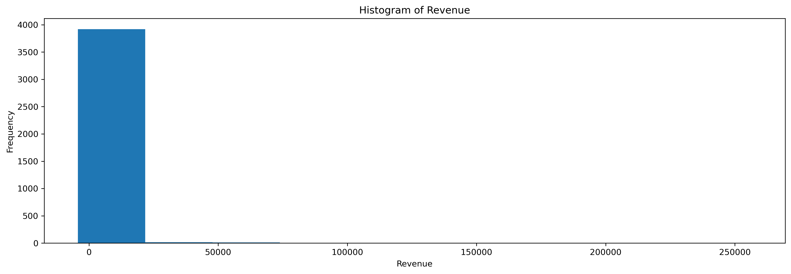
    


```python
sse={}
tx_rev = tx_user[['Revenue']]

for k in range(1, 10):
    kmeans = KMeans(n_clusters=k, max_iter=1000).fit(tx_rev)
    tx_rev["clusters"] = kmeans.labels_
    sse[k] = kmeans.inertia_ 
```


```python
plt.figure(figsize=(16,5), dpi=300)
plt.plot(list(sse.keys()), list(sse.values()))
plt.xlabel("Number of clusters for Revenue")
```


    Text(0.5, 0, 'Number of clusters for Revenue')


    
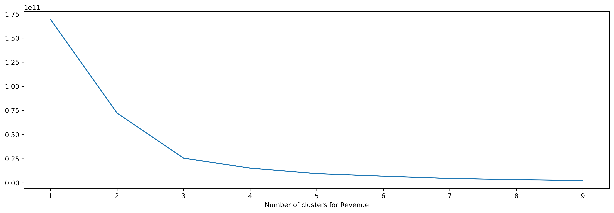
    


```python
kmeans = KMeans(n_clusters=3)
kmeans.fit(tx_user[['Revenue']])
tx_user['RevenueCluster'] = kmeans.predict(tx_user[['Revenue']]) 


```


```python
tx_user = order_cluster('RevenueCluster', 'Revenue',tx_user,True)
```


```python
tx_user.groupby('RevenueCluster')['Revenue'].describe()
```


<div>
<style scoped>
    .dataframe tbody tr th:only-of-type {
        vertical-align: middle;
    }

    .dataframe tbody tr th {
        vertical-align: top;
    }

    .dataframe thead th {
        text-align: right;
    }
</style>
<table border="1" class="dataframe">
  <thead>
    <tr style="text-align: right;">
      <th></th>
      <th>count</th>
      <th>mean</th>
      <th>std</th>
      <th>min</th>
      <th>25%</th>
      <th>50%</th>
      <th>75%</th>
      <th>max</th>
    </tr>
    <tr>
      <th>RevenueCluster</th>
      <th></th>
      <th></th>
      <th></th>
      <th></th>
      <th></th>
      <th></th>
      <th></th>
      <th></th>
    </tr>
  </thead>
  <tbody>
    <tr>
      <th>0</th>
      <td>3921.0</td>
      <td>1316.258790</td>
      <td>2054.745461</td>
      <td>-4287.63</td>
      <td>280.52</td>
      <td>621.66</td>
      <td>1487.80</td>
      <td>21535.90</td>
    </tr>
    <tr>
      <th>1</th>
      <td>27.0</td>
      <td>43070.445185</td>
      <td>15939.249588</td>
      <td>25748.35</td>
      <td>28865.49</td>
      <td>36351.42</td>
      <td>53489.79</td>
      <td>88125.38</td>
    </tr>
    <tr>
      <th>2</th>
      <td>2.0</td>
      <td>221960.330000</td>
      <td>48759.481478</td>
      <td>187482.17</td>
      <td>204721.25</td>
      <td>221960.33</td>
      <td>239199.41</td>
      <td>256438.49</td>
    </tr>
  </tbody>
</table>
</div>


```python
tx_user.head()
```


<div>
<style scoped>
    .dataframe tbody tr th:only-of-type {
        vertical-align: middle;
    }

    .dataframe tbody tr th {
        vertical-align: top;
    }

    .dataframe thead th {
        text-align: right;
    }
</style>
<table border="1" class="dataframe">
  <thead>
    <tr style="text-align: right;">
      <th></th>
      <th>CustomerID</th>
      <th>Recency</th>
      <th>RecencyCluster</th>
      <th>Frequency</th>
      <th>FrequencyCluster</th>
      <th>Revenue</th>
      <th>RevenueCluster</th>
    </tr>
  </thead>
  <tbody>
    <tr>
      <th>0</th>
      <td>17850.0</td>
      <td>301</td>
      <td>0</td>
      <td>34</td>
      <td>1</td>
      <td>5288.63</td>
      <td>0</td>
    </tr>
    <tr>
      <th>1</th>
      <td>13093.0</td>
      <td>266</td>
      <td>0</td>
      <td>12</td>
      <td>1</td>
      <td>7741.47</td>
      <td>0</td>
    </tr>
    <tr>
      <th>2</th>
      <td>13047.0</td>
      <td>31</td>
      <td>2</td>
      <td>17</td>
      <td>1</td>
      <td>3079.10</td>
      <td>0</td>
    </tr>
    <tr>
      <th>3</th>
      <td>15291.0</td>
      <td>25</td>
      <td>2</td>
      <td>20</td>
      <td>1</td>
      <td>4596.51</td>
      <td>0</td>
    </tr>
    <tr>
      <th>4</th>
      <td>14688.0</td>
      <td>7</td>
      <td>2</td>
      <td>27</td>
      <td>1</td>
      <td>5107.38</td>
      <td>0</td>
    </tr>
  </tbody>
</table>
</div>


## 4.4 Overall Segmentation


```python
tx_user['OverallScore'] = (tx_user['RecencyCluster']) + tx_user['FrequencyCluster'] + (tx_user['RevenueCluster'])

```


```python
round(tx_user.groupby('OverallScore')['Recency','Frequency','Revenue'].mean(),1)
```


<div>
<style scoped>
    .dataframe tbody tr th:only-of-type {
        vertical-align: middle;
    }

    .dataframe tbody tr th {
        vertical-align: top;
    }

    .dataframe thead th {
        text-align: right;
    }
</style>
<table border="1" class="dataframe">
  <thead>
    <tr style="text-align: right;">
      <th></th>
      <th>Recency</th>
      <th>Frequency</th>
      <th>Revenue</th>
    </tr>
    <tr>
      <th>OverallScore</th>
      <th></th>
      <th></th>
      <th></th>
    </tr>
  </thead>
  <tbody>
    <tr>
      <th>0</th>
      <td>293.7</td>
      <td>1.5</td>
      <td>362.7</td>
    </tr>
    <tr>
      <th>1</th>
      <td>153.7</td>
      <td>2.5</td>
      <td>644.7</td>
    </tr>
    <tr>
      <th>2</th>
      <td>33.3</td>
      <td>3.9</td>
      <td>1151.9</td>
    </tr>
    <tr>
      <th>3</th>
      <td>12.7</td>
      <td>19.5</td>
      <td>5771.0</td>
    </tr>
    <tr>
      <th>4</th>
      <td>4.5</td>
      <td>44.1</td>
      <td>38902.3</td>
    </tr>
    <tr>
      <th>5</th>
      <td>7.2</td>
      <td>106.8</td>
      <td>82491.6</td>
    </tr>
  </tbody>
</table>
</div>


The scoring above clearly shows us that customers with **score 5 are our best customers** whereas **0 is the worst**.

To keep things simple, better we name these scores:

**0 to 1:** Low Value

**2 to 3:** Mid Value

**4 to 5:** High Value overall score before segmentation


```python
tx_user['Segment'] = 'Low-Value'
tx_user.loc[tx_user['OverallScore']>1,'Segment'] = 'Mid-Value' 
tx_user.loc[tx_user['OverallScore']>3,'Segment'] = 'High-Value'
```


```python

tx_user.head()
```


<div>
<style scoped>
    .dataframe tbody tr th:only-of-type {
        vertical-align: middle;
    }

    .dataframe tbody tr th {
        vertical-align: top;
    }

    .dataframe thead th {
        text-align: right;
    }
</style>
<table border="1" class="dataframe">
  <thead>
    <tr style="text-align: right;">
      <th></th>
      <th>CustomerID</th>
      <th>Recency</th>
      <th>RecencyCluster</th>
      <th>Frequency</th>
      <th>FrequencyCluster</th>
      <th>Revenue</th>
      <th>RevenueCluster</th>
      <th>OverallScore</th>
      <th>Segment</th>
    </tr>
  </thead>
  <tbody>
    <tr>
      <th>0</th>
      <td>17850.0</td>
      <td>301</td>
      <td>0</td>
      <td>34</td>
      <td>1</td>
      <td>5288.63</td>
      <td>0</td>
      <td>1</td>
      <td>Low-Value</td>
    </tr>
    <tr>
      <th>1</th>
      <td>13093.0</td>
      <td>266</td>
      <td>0</td>
      <td>12</td>
      <td>1</td>
      <td>7741.47</td>
      <td>0</td>
      <td>1</td>
      <td>Low-Value</td>
    </tr>
    <tr>
      <th>2</th>
      <td>13047.0</td>
      <td>31</td>
      <td>2</td>
      <td>17</td>
      <td>1</td>
      <td>3079.10</td>
      <td>0</td>
      <td>3</td>
      <td>Mid-Value</td>
    </tr>
    <tr>
      <th>3</th>
      <td>15291.0</td>
      <td>25</td>
      <td>2</td>
      <td>20</td>
      <td>1</td>
      <td>4596.51</td>
      <td>0</td>
      <td>3</td>
      <td>Mid-Value</td>
    </tr>
    <tr>
      <th>4</th>
      <td>14688.0</td>
      <td>7</td>
      <td>2</td>
      <td>27</td>
      <td>1</td>
      <td>5107.38</td>
      <td>0</td>
      <td>3</td>
      <td>Mid-Value</td>
    </tr>
  </tbody>
</table>
</div>


```python
plt.figure(figsize=(16,5), dpi=300)
sns.scatterplot(data=tx_user, x="Recency", y="Revenue", hue="Segment")
plt.title('Customer Segments: Revenue and Recency')
```


    Text(0.5, 1.0, 'Customer Segments: Revenue and Recency')


    
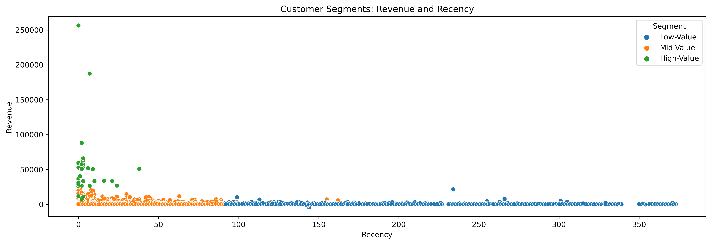
    


```python
plt.figure(figsize=(16,5), dpi=300)
sns.scatterplot(data=tx_user, x="Frequency", y="Revenue", hue="Segment")
plt.title('Customer Segments: Revenue and Frequency')
```


    Text(0.5, 1.0, 'Customer Segments: Revenue and Frequency')


    
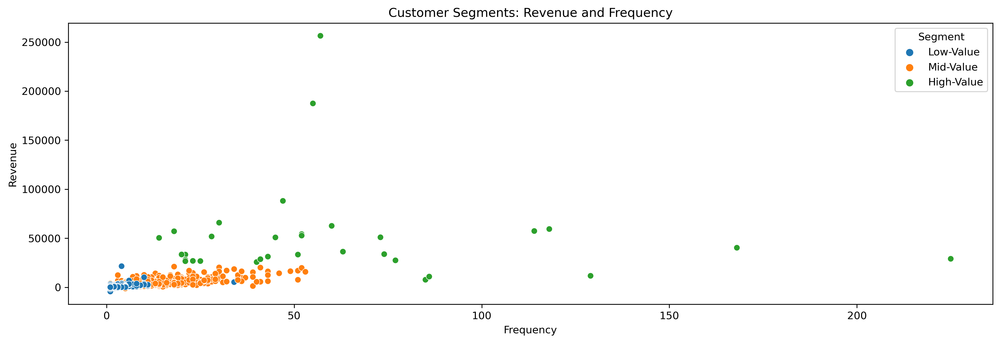
    


```python
plt.figure(figsize=(16,5), dpi=300)
sns.scatterplot(data=tx_user, x="Recency", y="Frequency", hue="Segment")
plt.title('Customer Segments: Recency and Frequency')
```


    Text(0.5, 1.0, 'Customer Segments: Recency and Frequency')


    
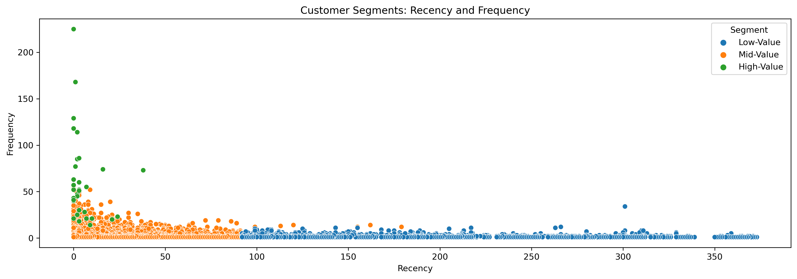
    


## 4.5 Recommendation

Customer Segment | Task | Action Plan
------------ | ------------- | -------------
High-value | Improve retention rate| Advertise new items and reward them, they are the best-customers.
Mid-value | Improve retention and frequency rate | Introduce discounts, new pricing plans and customer loyalty programs.
Low-value | Improve frequency| New advertisement strategy + discount plans.


```python

```
